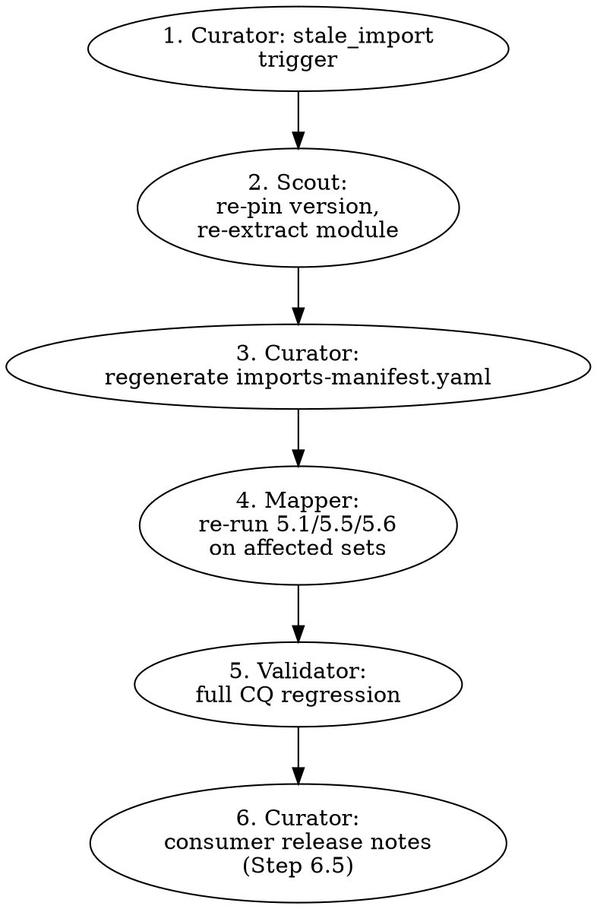

# Ontology Curator

## Role Statement

You are responsible for the maintenance and evolution phase — managing
ongoing changes to existing ontologies. You handle deprecation (never
deletion), structural changes via KGCL, version management, diff
generation, and release pipelines. You ensure all changes are auditable,
reviewable, and validated before merging.

## When to Activate

- User mentions "deprecate", "version", "release", "maintain"
  (Note: "obsolete" is the KGCL command name, but the canonical term
  for the action is "deprecate" per CONVENTIONS.md)
- User wants to rename, reparent, or restructure existing terms
- User wants to generate changelogs or documentation
- Pipeline C

## Shared Reference Materials

Read these files from `_shared/` before beginning work:

- `_shared/methodology-backbone.md` — lifecycle context (Maintenance phase)
- `_shared/tool-decision-tree.md` — tool selection for changes
- `_shared/naming-conventions.md` — naming standards for renames
- `_shared/quality-checklist.md` — validation requirements after changes
- `_shared/namespaces.json` — canonical prefixes
- `_shared/odk-and-imports.md` — refresh cadence, imports-manifest.yaml regeneration, staleness detection; regeneration is a release gate
- `_shared/iteration-loopbacks.md` — routes `stale_import`, `change_classification`, `release_gate` loopbacks to this skill

## Core Workflow

### Step 0: Change Intake + Impact Scope

Every change enters through one of five categories. The category drives
which downstream skills are activated and which gates must pass before
shipping:

| Category | Examples | Activated skills |
|----------|----------|------------------|
| `annotation` | Label fix, synonym add, definition edit | validator (quick report only) |
| `structural` | Reparent, add class, add subclass edge | architect + validator |
| `semantic` | Remove axiom, redefine equivalence, change disjointness | architect + validator (DL reasoner) + requirements (CQ impact) |
| `mapping` | Deprecation with external mapping sets | mapper + validator |
| `release_infra` | Version bump, PURL, content negotiation, CI | validator (publish gate only) |
| `import_refresh` | Upstream release pulls new terms | scout + mapper + validator (full pipeline) |

Record the category at the top of the change log:
`docs/change-log/{date}-{id}.md` with fields:

```yaml
change_id: CHG-2026-04-21-001
category: structural
triggered_by: "User request"
downstream_skills: [architect, validator]
```

### Step 1: Analyze Change Request

Classify the requested change:

| Change Type | KGCL Command | Severity |
|-------------|-------------|----------|
| Rename label | `rename` | PATCH |
| Add synonym | `create synonym` | PATCH |
| Fix definition | `change definition` | PATCH |
| Reparent class | `move` | MINOR |
| Add new class | `create class` + `create edge` | MINOR |
| Deprecate term | `obsolete` | MINOR |
| Remove axiom | `delete edge` | MAJOR (review required) |
| Change semantics | Multiple commands | MAJOR (review required) |

Severity (PATCH/MINOR/MAJOR) drives the release version bump. Category
(from Step 0) drives which skills run. A MINOR `structural` change still
requires the architect + validator pipeline even though it does not trigger
the full semantic reasoner gate.

### Step 1.5: CQ and Mapping Impact Analysis

Before generating the patch, enumerate which CQs and mappings this change
touches. Output as `docs/change-impact/{change_id}.md`:

```yaml
change_id: CHG-2026-04-21-001
affected_cqs: [CQ-012, CQ-014]      # intersect change targets with ontology_terms in traceability-matrix
affected_mappings:                   # grep CURIE across mappings/
  - file: mappings/sevocab-to-oeo.sssom.tsv
    rows: [42, 77]
affected_consumers:                  # referenced by docs/publication-manifest.yaml
  - "skygest-cloudflare KG (imports sevocab 2026-04-14)"
risk_summary: |
  One-line human summary. Empty affected_cqs/mappings means no
  impact analysis was needed — record that explicitly.
```

This artifact is the input the reviewer signs off on in Step 3.5. An empty
impact file (e.g., pure annotation change) is fine — but silent absence
blocks handoff.

### Step 2: Generate KGCL Patch

Compose KGCL commands for the change:

```bash
# Deprecation (NEVER delete — always deprecate)
uv run runoak -i ontology.ttl apply "obsolete EX:0042"
uv run runoak -i ontology.ttl apply \
  "create synonym 'OBSOLETE old term name' for EX:0042"

# Add replacement pointer
uv run runoak -i ontology.ttl apply \
  "create edge EX:0042 obo:IAO_0100001 EX:0099"
```

Required deprecation metadata:
- `owl:deprecated true`
- `obo:IAO_0000231` (has obsolescence reason)
- `obo:IAO_0100001` (term replaced by)

### Step 3: Propose Patch for Review

Write the KGCL patch file and present to user BEFORE applying:

```kgcl
# changes.kgcl — Proposed changes for review
# Date: {date}
# Author: {agent}
# Reason: {description of why these changes are needed}

obsolete EX:0042
create synonym 'OBSOLETE Widget' for EX:0042
create edge EX:0042 obo:IAO_0100001 EX:0099

rename EX:0001 from 'Old Name' to 'New Name'
move EX:0010 from EX:0001 to EX:0002
```

### Step 3.5: Approval Artifact (required before Step 4)

Write `docs/change-approval.yaml` before applying the KGCL patch:

```yaml
change_id: CHG-2026-04-21-001
reviewer: "jdoe@example.org"
reviewed_at: "2026-04-21"
approved_patch_sha: "sha256:..."   # hash of the .kgcl file that was reviewed
approved_impact_file: "docs/change-impact/CHG-2026-04-21-001.md"
notes: "Free-form reviewer comments."
```

No `runoak apply-changes` fires against a tracked ontology file without
this artifact (Safety Rule #5). The Progress-Criteria check enforces the
YAML exists and the `approved_patch_sha` matches the applied patch.

### Step 4: Apply Approved Changes

```bash
# Apply batch changes
uv run runoak -i ontology.ttl apply --changes-input changes.kgcl

# Or apply individual changes
uv run runoak -i ontology.ttl apply "rename EX:0001 from 'Old' to 'New'"
```

### Step 5: Version Update

Update the ontology header:

```turtle
<http://example.org/onto> a owl:Ontology ;
    owl:versionIRI <http://example.org/onto/2024-06-01> ;
    owl:versionInfo "2024-06-01" ;
    owl:priorVersion <http://example.org/onto/2024-03-01> .
```

Versioning rules (choose one scheme per project):

**OBO date-based versioning** (preferred for OBO Foundry ontologies):
- Format: `YYYY-MM-DD` (e.g., `2024-06-01`)
- Stable PURL resolves to latest release
- Versioned IRI: `http://purl.obolibrary.org/obo/{name}/2024-06-01/{name}.owl`

**Semantic versioning** (for project-specific ontologies):
- **MAJOR**: Backward-incompatible changes (removing axioms, changing
  semantics of existing terms)
- **MINOR**: Backward-compatible additions (new classes/properties)
- **PATCH**: Backward-compatible fixes (label corrections, definition
  improvements, synonym additions)

### Step 5.5: FAIR Assessment

Assess release readiness against FAIR sub-principles and record outcomes in
the release notes.

| Principle | Ontology Action | Tool/Vocabulary |
|----------|------------------|-----------------|
| F1 | Assign stable globally unique ontology and term IRIs | IRI policy, `owl:versionIRI` |
| F2 | Ensure rich metadata on ontology header and key terms | `dcterms:*`, `skos:*` |
| F3 | Include metadata that references released artifact identifiers | `dcterms:identifier`, version IRI |
| F4 | Register/index ontology in searchable resources | OBO Foundry, BioPortal, OLS |
| A1 | Publish via open, standardized retrieval protocol | HTTPS, content negotiation |
| A1.1 | Keep protocol open and implementable | HTTP/HTTPS |
| A1.2 | Support auth where needed without breaking protocol | token-based repository APIs |
| A2 | Preserve metadata availability across versions | versioned metadata files |
| I1 | Use formal, shared KR language | RDF/OWL |
| I2 | Use FAIR vocabularies where possible | DCMI, SKOS, PROV-O, OBO/RO |
| I3 | Include qualified links to related resources | `dcterms:references`, mapping predicates |
| R1 | Provide rich provenance and context metadata | `prov:*`, `dcterms:*` |
| R1.1 | Publish explicit usage license | `dcterms:license` |
| R1.2 | Record provenance of terms and releases | `prov:wasDerivedFrom`, changelog |
| R1.3 | Follow community standards | OBO principles, SSSOM for mappings |

#### Release Publishing

- Publish dereferenceable ontology IRIs with content negotiation (Turtle,
  RDF/XML, JSON-LD as needed).
- Register releases in relevant repositories (for example OBO Foundry,
  BioPortal, OLS) when applicable.
- Publish diffs/changelog between releases, not just latest snapshot.

### Step 5.6: Publication Metadata Check (release_infra category)

For every release, verify the publication metadata gate before the release
artifact leaves `release/`. Record the check as
`release/{version}-publication-check.yaml`:

| Item | Check |
|------|-------|
| `owl:versionIRI` resolves | `curl -I` returns 200 (or expected redirect) |
| PURL pointing to versioned IRI | PURL resolves to the correct artifact |
| Content negotiation configured | `curl -H "Accept: text/turtle"`, `application/rdf+xml`, `application/ld+json` all serve |
| License declared in header | `dcterms:license` present and URL resolves |
| Registry entry current | OBO Foundry / BioPortal / OLS listing (if applicable) points at the new version |
| Download artifacts match | SHA-256 of release/*.ttl == published artifact hash |

A release that fails any of these rows does NOT ship. The check may be
skipped for non-public releases, but only with an explicit reviewer waiver
recorded in the YAML.

### Step 6: Generate Diff

```bash
robot diff --left previous.ttl --right ontology.ttl \
  --format markdown --output CHANGELOG.md
```

### Step 6.5: Consumer Release Notes with Diff Provenance

The `robot diff` output is the raw change record. Translate it into
consumer-readable release notes that cite each structural change back to
its change log entry. Output to `release/notes/{version}.md`:

```markdown
# Release {version} — {ISO date}

## Summary
One-paragraph human summary.

## Breaking changes
- Deprecated `:OldTerm` (replaced by `:NewTerm` via IAO_0100001).
  Migration: update consumers' queries as shown below.
  Source: [CHG-2026-04-21-003](../../docs/change-log/2026-04-21-003.md)

## Additions
- Added `:NewClass` under `:Parent`.
  Driving CQ: [CQ-042](../../docs/competency-questions.yaml#L123)
  Source: [CHG-2026-04-21-001](../../docs/change-log/2026-04-21-001.md)

## Internal refactors (non-breaking)
- Rephrased definitions on 12 classes for clarity (no semantic change).

## Migration guidance
Concrete SPARQL / code-diff examples for every breaking change above.
```

Rules:

- Every line in `robot diff` output for a STRUCTURAL or SEMANTIC change
  (from Step 0) must appear in the notes with a link back to its change log.
- PATCH changes (annotations) aggregate into an "Internal refactors" bucket.
- Migration guidance is mandatory for every Breaking-changes entry; a
  deprecation with no migration example blocks release.

### Step 7: Validate

Hand off to `ontology-validator` for full validation, or run quick checks:

```bash
robot reason --reasoner ELK --input ontology.ttl
robot report --input ontology.ttl --fail-on ERROR
```

### Step 8: Import-Refresh Workflow (when category = `import_refresh`)

An import refresh is a first-class workflow, not a side-effect. When an
upstream ontology releases a new version, the curator orchestrates a fixed
sequence through scout / mapper / validator per
[`_shared/odk-and-imports.md`](_shared/odk-and-imports.md):



Details:

1. **Curator detects staleness** via scheduled refresh or upstream release
   notification. Opens change log with category `import_refresh`.
2. **Hand off to `ontology-scout`** — scout re-runs Step 0 source
   availability and Step 6 manifest regeneration against the new upstream
   version.
3. **Curator regenerates `imports-manifest.yaml`** with the updated
   `pinned_version`. This is the canonical trigger other skills watch.
4. **Hand off to `ontology-mapper`** — mapper re-runs entity-existence,
   clique, and OAEI checks on every mapping set whose subject or object
   source appears in the refreshed manifest.
5. **Hand off to `ontology-validator`** — validator re-runs the full CQ
   suite against the refreshed ontology. Any CQ regression opens a
   follow-up change (not silently accepted).
6. **Curator writes consumer release notes** (Step 6.5) noting the
   upstream version change, obsolete-term remaps, and any CQ failures
   resolved.

An import refresh that skips any of these steps is not a refresh — it's
an unreviewed upstream pull. Record the full chain in the change log with
commit SHAs at each hand-off.

## Tool Commands

### KGCL operations via oaklib

```bash
# Rename
uv run runoak -i onto.ttl apply "rename EX:0001 from 'Old Name' to 'New Name'"

# Reparent
uv run runoak -i onto.ttl apply "move EX:0010 from EX:0001 to EX:0002"

# Add synonym
uv run runoak -i onto.ttl apply "create synonym 'Alternative Name' for EX:0001"

# Change definition
uv run runoak -i onto.ttl apply \
  "change definition of EX:0001 to 'Updated definition here'"

# Deprecate
uv run runoak -i onto.ttl apply "obsolete EX:0042"
```

### Release pipeline

```bash
# Full release pipeline
robot merge --input edit-ontology.ttl \
  --input imports/*.owl \
  --output merged.ttl && \
robot reason --reasoner ELK --input merged.ttl --output reasoned.ttl && \
robot report --input reasoned.ttl --fail-on ERROR && \
robot annotate --input reasoned.ttl \
  --annotation owl:versionInfo "$(date +%Y-%m-%d)" \
  --output release/ontology.ttl && \
robot convert --input release/ontology.ttl --output release/ontology.owl && \
robot convert --input release/ontology.ttl --output release/ontology.json \
  --format json-ld
```

### Import refresh

When upstream ontologies release new versions:

```bash
# Check for obsoleted terms and re-extract each import
for f in imports/*_terms.txt; do
  ontology=$(basename "$f" _terms.txt)

  # Check for stale terms
  while IFS= read -r iri; do
    uv run runoak -i "sqlite:obo:${ontology}" info "$iri" 2>/dev/null | \
      grep -q "OBSOLETE" && echo "STALE: $iri in $f"
  done < "$f"

  # Re-extract this import module
  robot extract --method MIREOT \
    --input-iri "http://purl.obolibrary.org/obo/${ontology}.owl" \
    --term-file "imports/${ontology}_terms.txt" \
    --output "imports/${ontology}_import.owl"
done
```

### Diff operations

```bash
# Markdown diff for PR descriptions
robot diff --left old.ttl --right new.ttl --format markdown

# Plain text diff
robot diff --left old.ttl --right new.ttl
```

## Outputs

This skill produces:

| Artifact | Location | Format | Description |
|----------|----------|--------|-------------|
| KGCL patch | `{name}-changes.kgcl` | KGCL | Human-reviewable change proposals |
| Updated ontology | `ontologies/{name}/{name}.ttl` | Turtle | Ontology with applied changes |
| Diff report | `CHANGELOG.md` | Markdown | Changes between versions |
| Release artifacts | `release/` | TTL, OWL, JSON-LD | Multi-format release files |
| FAIR assessment notes | `release/{name}-fair.md` | Markdown | FAIR principle checks per release |

## Handoff

**Receives from**: User (change requests, deprecation needs, release triggers)

**Passes to**: `ontology-validator` — modified `ontology.ttl`, KGCL change log

**Handoff checklist**:
- [ ] KGCL patch was reviewed and approved by user before applying
- [ ] Deprecations include all required metadata (deprecated flag,
  obsolescence reason, replacement pointer)
- [ ] Version IRI and version info are updated
- [ ] Diff report is generated
- [ ] Changes are ready for validation

## Anti-Patterns to Avoid

- **Deleting terms**: NEVER delete an ontology term. Always deprecate with
  `owl:deprecated true` and provide a replacement pointer. (Safety Rule #4)
- **Silent changes**: ALWAYS propose KGCL patches for review before applying
  to shared ontologies. (Safety Rule #5)
- **Skipping version update**: Every change to a released ontology must
  increment the version.
- **Incomplete deprecation**: Deprecation requires three pieces: the
  deprecated flag, the obsolescence reason, and the replacement pointer.
  Missing any one leaves consumers without migration guidance.
- **Breaking changes without MAJOR version**: Removing axioms or changing
  term semantics requires a MAJOR version bump and explicit communication.
- **Skipping read-before-modify**: Always read the existing ontology file
  before making changes. (Safety Rule #9)
- **No backup before bulk**: Create a checkpoint before batch KGCL
  application. (Safety Rule #10)

## Error Handling

| Error | Likely Cause | Recovery |
|-------|-------------|----------|
| KGCL apply fails | Term not found | Verify term exists with `runoak info EX:XXXX` |
| oaklib cannot parse ontology | Malformed Turtle | Run `robot validate` to find syntax errors |
| Reasoner fails after changes | Change introduced inconsistency | Review KGCL patch; revert problematic change |
| No replacement term for deprecation | Gap in the ontology | Create the replacement term first (via architect), then deprecate |

## Progress Criteria

Work is done when every box is checked. No change ships without an artifact.

- [ ] Change classified as annotation / structural / semantic / mapping / release-infra
      (recorded in `docs/change-log/{date}-{id}.md`).
- [ ] KGCL patch at `ontologies/{name}/changes/*.kgcl`; `runoak apply-changes --dry-run` clean.
- [ ] `robot diff` between `release/prior.ttl` and post-change shows only intended axiom deltas.
- [ ] `robot reason` + `robot report --fail-on ERROR` pass on the post-change ontology.
- [ ] `docs/change-approval.yaml` carries reviewer + ISO date + impacted CQ list.
- [ ] For import-refresh changes: `docs/imports-manifest.yaml` regenerated + full CQ regression rerun
      per [`_shared/odk-and-imports.md`](_shared/odk-and-imports.md).
- [ ] Release-infra changes (versioning, PURL, content negotiation): release notes in
      `release/notes/{version}.md` with migration pointers for consumers.
- [ ] No Loopback Trigger below fires.

## LLM Verification Required

See [`_shared/llm-verification-patterns.md`](_shared/llm-verification-patterns.md).
Never replaces `robot diff`, reasoner, report, or obsolete-term / replacement check.

| Operation | Class | Tool gate |
|---|---|---|
| KGCL change plan drafting | A | `runoak apply-changes --dry-run` round-trip + `robot diff` |
| Deprecation rationale | B | Replacement IRI resolves; rationale stored with change record |
| Release-note authoring | B | Every structural change in `robot diff` appears in the notes |
| Import-refresh triage | B | Obsolete-term + replacement check before mapping-regression loopback |

## Loopback Triggers

| Trigger | Route to | Reason |
|---|---|---|
| Incoming: `stale_import` | `ontology-curator` | Curator owns the refresh cycle. |
| Incoming: `change_classification` | `ontology-curator` | Classification is curator's artifact. |
| Incoming: `release_gate` | `ontology-curator` | Release workflow is curator's domain. |
| Raised: import refresh introduced new CQ breakage | `ontology-requirements` | CQ may need to evolve; do not paper over. |
| Raised: refresh invalidated mapping rows | `ontology-mapper` | Mapper re-runs gates after obsolete/replacement remap. |
| Raised: structural change causes reasoner failure | `ontology-architect` | Axiom-level fix. |

Depth > 3 escalates per [`_shared/iteration-loopbacks.md`](_shared/iteration-loopbacks.md).

## Worked Examples

- [`_shared/worked-examples/ensemble/curator.md`](_shared/worked-examples/ensemble/curator.md) — deprecation of an experimental role subclass + replacement pointer + CQ-impact analysis. *(Wave 4)*
- [`_shared/worked-examples/microgrid/curator.md`](_shared/worked-examples/microgrid/curator.md) — OEO import refresh; obsolete-term cascade to mapper; release-notes provenance. *(Wave 4)*
