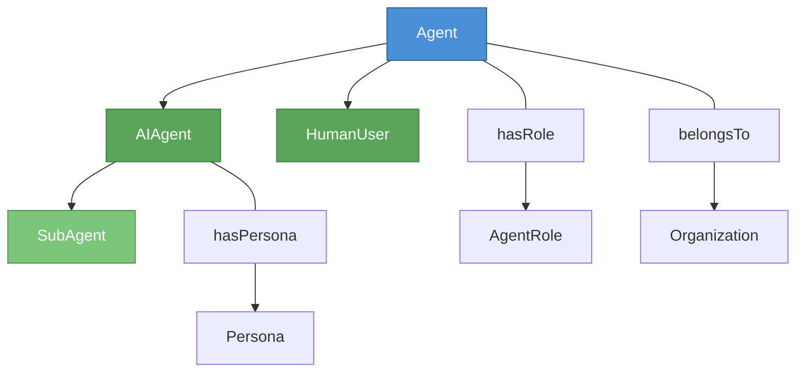
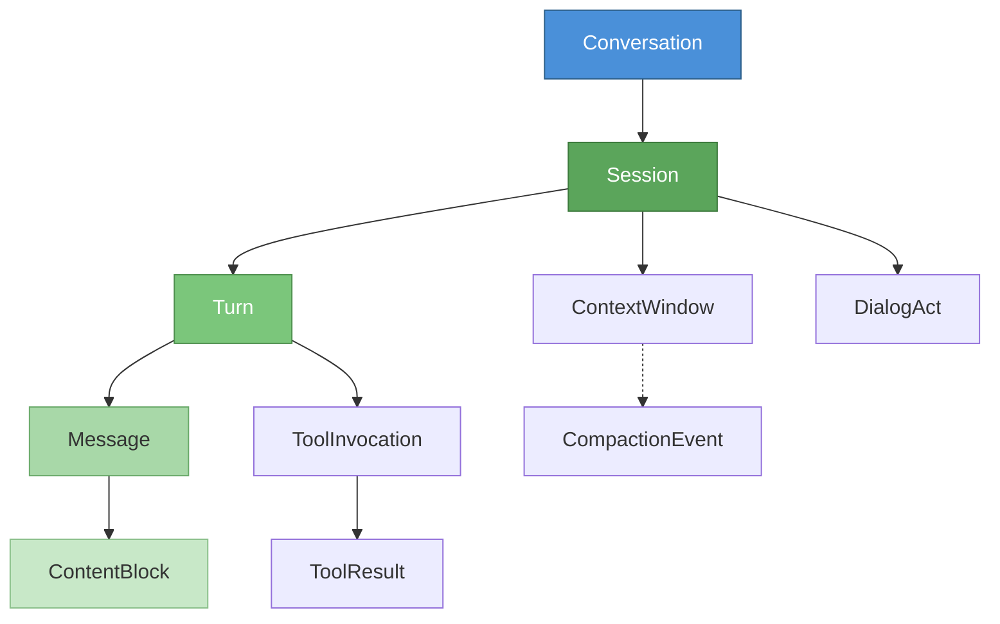
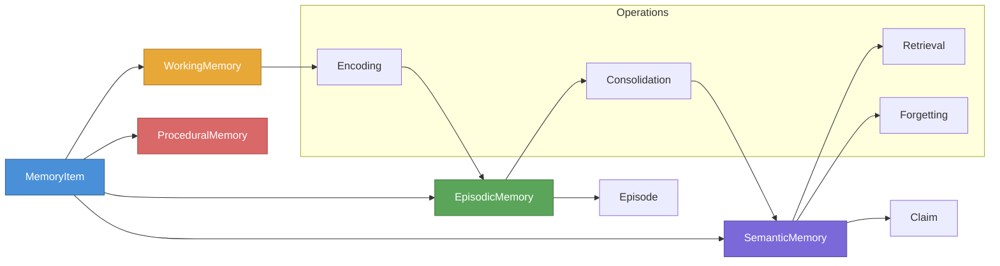
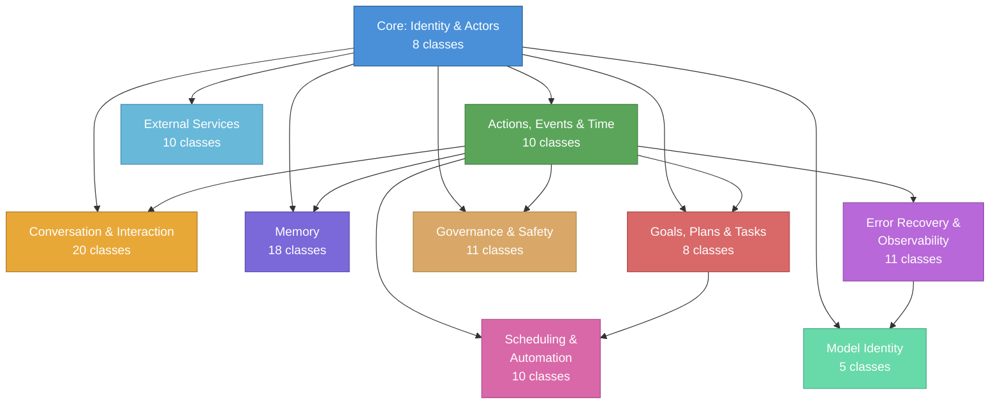

# PAO Blog Post Implementation Plan

> **For Claude:** REQUIRED SUB-SKILL: Use superpowers:executing-plans to implement this plan task-by-task.

**Goal:** Publish a blog post on mepuka.me introducing the Personal Agent Ontology, with pyLODE HTML docs and SVG diagrams.

**Architecture:** Two repos involved — ontology_skill (generate pyLODE HTML + diagrams) and mepuka-website (blog post MDX + static assets). Tasks alternate between repos. Diagrams are hand-crafted Mermaid rendered to SVG for editorial control over what's shown.

**Tech Stack:** pyLODE (HTML generation), Mermaid CLI (SVG diagrams), Astro MDX (blog post), uv (Python package manager)

---

### Task 1: Install pyLODE in the ontology project

**Files:**
- Modify: `/Users/pooks/Dev/ontology_skill/pyproject.toml` (via uv add)

**Step 1: Add pyLODE as a dev dependency**

Run: `cd /Users/pooks/Dev/ontology_skill && uv add --group dev pylode`
Expected: pyproject.toml updated, uv.lock regenerated

**Step 2: Verify pyLODE works**

Run: `cd /Users/pooks/Dev/ontology_skill && uv run pylode --version`
Expected: Prints version (3.x)

**Step 3: Commit**

```bash
cd /Users/pooks/Dev/ontology_skill
git add pyproject.toml uv.lock
git commit -m "chore: add pylode dev dependency for HTML documentation generation"
```

---

### Task 2: Generate pyLODE HTML documentation from the PAO ontology

**Files:**
- Read: `/Users/pooks/Dev/ontology_skill/ontologies/personal_agent_ontology/personal_agent_ontology.ttl`
- Create: `/Users/pooks/Dev/ontology_skill/ontologies/personal_agent_ontology/release/pao-docs.html`

**Step 1: Generate HTML with pyLODE**

Run:
```bash
cd /Users/pooks/Dev/ontology_skill
uv run pylode \
  ontologies/personal_agent_ontology/personal_agent_ontology.ttl \
  -o ontologies/personal_agent_ontology/release/pao-docs.html
```
Expected: HTML file created with class descriptions, property tables, hierarchy.

**Step 2: Verify the HTML renders correctly**

Run: `open ontologies/personal_agent_ontology/release/pao-docs.html`
Expected: Browser opens with formatted ontology documentation. Check that classes, properties, and metadata are rendered.

**Step 3: If pyLODE has issues with imports, try with the release TTL instead**

The release TTL may be more self-contained:
```bash
cd /Users/pooks/Dev/ontology_skill
uv run pylode \
  ontologies/personal_agent_ontology/release/personal_agent_ontology.ttl \
  -o ontologies/personal_agent_ontology/release/pao-docs.html
```

**Step 4: Commit**

```bash
cd /Users/pooks/Dev/ontology_skill
git add ontologies/personal_agent_ontology/release/pao-docs.html
git commit -m "docs(pao): generate pyLODE HTML documentation"
```

---

### Task 3: Create SVG diagrams for the blog post

**Files:**
- Create: `/Users/pooks/Dev/mepuka-website/public/blog/personal-agent-ontology/actor-hierarchy.svg`
- Create: `/Users/pooks/Dev/mepuka-website/public/blog/personal-agent-ontology/conversation-stack.svg`
- Create: `/Users/pooks/Dev/mepuka-website/public/blog/personal-agent-ontology/memory-architecture.svg`
- Create: `/Users/pooks/Dev/mepuka-website/public/blog/personal-agent-ontology/module-map.svg`

Create 4 Mermaid diagrams and render to SVG. Each diagram should use a clean,
minimal style suitable for the mepuka.me dark/light theme (no bright
backgrounds, use transparent backgrounds, dark strokes).

**Step 1: Create the public directory**

Run: `mkdir -p /Users/pooks/Dev/mepuka-website/public/blog/personal-agent-ontology`

**Step 2: Install mermaid-cli if not available**

Run: `npx --yes @mermaid-js/mermaid-cli --version`
Expected: Prints version or installs it.

**Step 3: Create and render actor-hierarchy diagram**

Create a Mermaid file at `/Users/pooks/Dev/mepuka-website/public/blog/personal-agent-ontology/actor-hierarchy.mmd`:



Render: `npx @mermaid-js/mermaid-cli -i public/blog/personal-agent-ontology/actor-hierarchy.mmd -o public/blog/personal-agent-ontology/actor-hierarchy.svg -b transparent`

**Step 4: Create and render conversation-stack diagram**

Create `/Users/pooks/Dev/mepuka-website/public/blog/personal-agent-ontology/conversation-stack.mmd`:



Render: `npx @mermaid-js/mermaid-cli -i public/blog/personal-agent-ontology/conversation-stack.mmd -o public/blog/personal-agent-ontology/conversation-stack.svg -b transparent`

**Step 5: Create and render memory-architecture diagram**

Create `/Users/pooks/Dev/mepuka-website/public/blog/personal-agent-ontology/memory-architecture.mmd`:



Render: `npx @mermaid-js/mermaid-cli -i public/blog/personal-agent-ontology/memory-architecture.mmd -o public/blog/personal-agent-ontology/memory-architecture.svg -b transparent`

**Step 6: Create and render module-map diagram**

Create `/Users/pooks/Dev/mepuka-website/public/blog/personal-agent-ontology/module-map.mmd`:



Render: `npx @mermaid-js/mermaid-cli -i public/blog/personal-agent-ontology/module-map.mmd -o public/blog/personal-agent-ontology/module-map.svg -b transparent`

**Step 7: Verify all SVGs rendered**

Run: `ls -la /Users/pooks/Dev/mepuka-website/public/blog/personal-agent-ontology/*.svg`
Expected: 4 SVG files

**Step 8: Delete the .mmd source files (not needed in public)**

Run: `rm /Users/pooks/Dev/mepuka-website/public/blog/personal-agent-ontology/*.mmd`

**Step 9: Commit**

```bash
cd /Users/pooks/Dev/mepuka-website
git add public/blog/personal-agent-ontology/
git commit -m "feat: add SVG diagrams for PAO blog post"
```

---

### Task 4: Write the blog post MDX file

**Files:**
- Create: `/Users/pooks/Dev/mepuka-website/src/content/blog/personal-agent-ontology.mdx`

**Step 1: Write the blog post**

Create the MDX file with this structure. Write in the author's voice — exploratory,
thinking-out-loud, technically grounded but accessible. Match the style of
existing posts (agent-native-cli.mdx, analyzing-academic-bluesky.mdx).

Frontmatter:
```yaml
---
title: "Mapping the Domain of a Personal AI Agent"
description: "In the wake of OpenClaw and the proliferation of personal agent implementations, I used formal ontology engineering to map the shared architecture."
date: 2026-02-23
tags: [ontology, agents, knowledge-graphs, architecture]
---
```

Section structure (from the design doc):

1. **Hook** (~300 words): The proliferation of agent implementations, the missing
   shared vocabulary, formal ontology as the approach. Mention OpenClaw, Claude Code.
   Introduce PAO: 115 classes, 9 modules. Link to pyLODE HTML docs.

2. **What Is a Personal Agent?** (~400 words): Identity layer. Agent hierarchy
   (Agent → AIAgent, HumanUser, SubAgent). Persona, Roles, Organization. BFO
   alignment briefly. Include actor-hierarchy.svg diagram:
   ``

3. **The Conversation Stack** (~500 words): Conversation → Session → Turn →
   Message → ContentBlock. ContextWindow and CompactionEvent as first-class
   concerns. ToolInvocation lifecycle. Include conversation-stack.svg diagram.

4. **Memory Is Not a Database** (~500 words): Multi-tier memory (Working,
   Episodic, Semantic, Procedural). Memory operations (Encoding, Retrieval,
   Consolidation, Forgetting). Provenance via PROV-O. Cognitive science parallel.
   Include memory-architecture.svg diagram.

5. **The Full Map** (~400 words): Brief survey of remaining modules (Goals/BDI,
   Governance, Services, Recovery, Scheduling). Return to "why formalize?" —
   shared vocabulary, converging architecture. Include module-map.svg diagram.
   Link to pyLODE docs, GitHub repo.

Key writing guidelines:
- Use the author's voice from existing posts — direct, technical, no filler
- No academic jargon without explanation
- Use code-style backticks for class names: `Agent`, `Session`, `MemoryItem`
- Reference real implementations (OpenClaw, Claude Code) as examples
- Keep paragraphs short (3-5 sentences)
- Use `##` for section headers (matching existing post style)
- Images use `` tags with the pattern from analyzing-academic-bluesky.mdx

**Step 2: Review the post for consistency with existing blog style**

Read the existing posts again if needed. Check:
- Frontmatter schema matches (title, description, date, tags)
- Section headers use `##` (not `#`)
- Image paths use absolute paths from public root: `/blog/personal-agent-ontology/`
- No trailing whitespace, consistent markdown

**Step 3: Commit**

```bash
cd /Users/pooks/Dev/mepuka-website
git add src/content/blog/personal-agent-ontology.mdx
git commit -m "feat: add PAO domain cartography blog post (draft)"
```

---

### Task 5: Copy pyLODE HTML to the website for hosting

**Files:**
- Copy: `ontology_skill/.../release/pao-docs.html` → `mepuka-website/public/pao/index.html`

**Step 1: Create the pao directory in public**

Run: `mkdir -p /Users/pooks/Dev/mepuka-website/public/pao`

**Step 2: Copy the pyLODE HTML**

Run: `cp /Users/pooks/Dev/ontology_skill/ontologies/personal_agent_ontology/release/pao-docs.html /Users/pooks/Dev/mepuka-website/public/pao/index.html`

**Step 3: Verify the HTML is accessible**

Run: `ls -la /Users/pooks/Dev/mepuka-website/public/pao/index.html`
Expected: File exists, reasonable size (50-200 KB)

**Step 4: Update the blog post to link to /pao/**

Edit `/Users/pooks/Dev/mepuka-website/src/content/blog/personal-agent-ontology.mdx`:
Ensure the hook section contains a link like `[full interactive documentation](/pao/)`.

**Step 5: Commit**

```bash
cd /Users/pooks/Dev/mepuka-website
git add public/pao/index.html src/content/blog/personal-agent-ontology.mdx
git commit -m "feat: host pyLODE documentation at /pao/"
```

---

### Task 6: Build and preview the site locally

**Files:**
- Read: `/Users/pooks/Dev/mepuka-website/package.json` (for dev command)

**Step 1: Install dependencies if needed**

Run: `cd /Users/pooks/Dev/mepuka-website && npm install`

**Step 2: Start the dev server**

Run: `cd /Users/pooks/Dev/mepuka-website && npm run dev`

**Step 3: Preview the blog post**

Open: `http://localhost:4321/blog/personal-agent-ontology`
Check:
- Post renders correctly
- All 4 SVG diagrams display
- Frontmatter (title, date, description) renders properly
- Links work

**Step 4: Preview the pyLODE docs**

Open: `http://localhost:4321/pao/`
Check: HTML documentation renders with ontology classes and properties.

**Step 5: Fix any rendering issues found during preview**

Common issues:
- SVG sizing: adjust `style` attributes on `` tags
- pyLODE HTML CSS conflicts with site theme: may need to wrap in an iframe or adjust
- Broken internal links in pyLODE HTML

**Step 6: Commit any fixes**

```bash
cd /Users/pooks/Dev/mepuka-website
git add -A
git commit -m "fix: adjust blog post rendering and pyLODE integration"
```

---

### Task 7: Final review and remove draft status

**Step 1: Re-read the full blog post end-to-end**

Read `/Users/pooks/Dev/mepuka-website/src/content/blog/personal-agent-ontology.mdx`
in its entirety. Check for:
- Coherent narrative flow (hook → identity → conversation → memory → full map)
- Consistent voice (exploratory, not academic)
- All diagram references work
- pyLODE link works
- No TODO placeholders left
- Correct class names (cross-reference with PAO source)

**Step 2: Ensure draft: false (or remove draft field)**

The frontmatter should NOT have `draft: true`. By default the schema sets
`draft: false` so omitting it is fine.

**Step 3: Final commit**

```bash
cd /Users/pooks/Dev/mepuka-website
git add -A
git commit -m "feat: finalize PAO blog post for publication"
```
