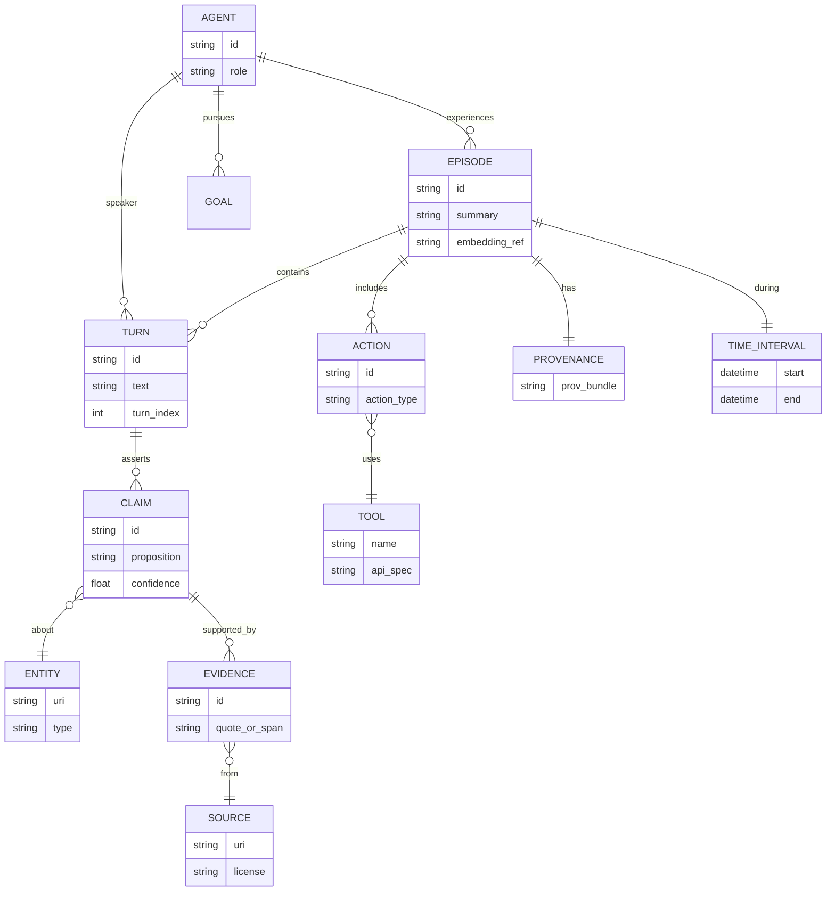

# Agent Memory Architectures and Ontologies for Memory and Interaction

## Executive summary

Agent “memory” is best treated as an engineered *portfolio* of representational stores and control processes, not a single component. Across both cognitive science and deployed AI systems, the most stable decomposition is: (a) multiple memory *types* (e.g., working vs long-term; episodic vs semantic; declarative vs non-declarative), (b) memory *mechanisms* (encoding, indexing, retrieval, consolidation, rehearsal/replay, and forgetting), and (c) memory *governance* (privacy, safety, access control, and provenance). This decomposition aligns with classical multi-store and control-process views of human memory and their descendants, while mapping cleanly onto modern agent architectures that combine LLM context windows with external stores and retrieval policies. citeturn0search4turn0search13turn0search3turn19search1turn4search3

Modern agent memory architectures cluster into several recurring patterns: (1) **in-context (working) memory** only; (2) **event-log + summarization** (compression as consolidation); (3) **retrieval-augmented memory** using dense embeddings and approximate nearest neighbor (ANN) vector search; (4) **symbolic/structured memory** using knowledge graphs (RDF/OWL) and rule/constraint layers; and (5) **hybrid, multi-store systems** that deliberately separate episodic traces (time-stamped experiences) from semantic knowledge (generalized facts), often adding provenance tracking and deletion workflows. These patterns are visible both in the research literature on explicit memory (e.g., RAG, memory networks, external-memory neural architectures) and in practical agent frameworks that expose “memory” abstractions over vector stores and structured state. citeturn3search3turn3search2turn3search0turn4search0turn10search2turn10search3turn13search2turn13search3

Ontologies and knowledge-representation (KR) frameworks provide the missing “contract” layer for long-lived, interoperable agent memory: RDF graphs (triples) as a substrate, RDFS/OWL for semantics, SPARQL for querying, SHACL for validation, PROV-O for provenance, and domain/upper ontologies (e.g., DOLCE, BFO, SUMO) for alignment across domains. This stack enables *typed* memory (what kinds of things are stored), *auditable* memory (where it came from), and *governable* memory (how it can be corrected or erased). citeturn1search0turn1search1turn15search0turn18search0turn18search3turn2search5turn2search16turn2search2

A rigorous conscious/subconscious framing is useful primarily as a **control abstraction**: “subconscious” corresponds to fast, automatic, background processes (retrieval scoring, caching, attention/precision weighting, consolidation), while “conscious” corresponds to globally broadcast, capacity-limited, reportable deliberation (workspace-style integration, explicit planning, reflective summarization). This mapping is strongly motivated by Global Workspace / Global Neuronal Workspace models, predictive processing/free-energy perspectives, and dual-process (Type 1/Type 2) theories—each of which suggests distinct design levers, failure modes, and evaluation strategies for agents. citeturn8search4turn8search1turn8search2turn9search0turn8search3

## Definitions and taxonomy of memory types

In cognitive and computational traditions, “memory” refers both to **stores** (where information resides) and to **control processes** (how information is encoded, maintained, and retrieved). The classical multi-store framing separates at least short-lived storage from long-lived storage and treats rehearsal/coding/search as control processes that determine transfer, accessibility, and decay. citeturn0search4turn0search12

A widely used taxonomy (with strong empirical and computational uptake) separates:

- **Working memory**: capacity-limited, actively maintained information used for ongoing cognition; often conceptualized as a system with multiple components coordinated by control (executive) processes rather than a single short-term buffer. citeturn0search2turn0search22
- **Short-term memory (STM)**: traditionally a temporary store in multi-store models; in practice, “STM” is often treated as overlapping with or subsumed by working memory models, especially when emphasizing manipulation/control. citeturn0search4turn0search2
- **Long-term memory (LTM)**: relatively durable storage, with multiple subsystems. citeturn0search3turn0search19
- **Declarative (explicit) vs non-declarative (implicit) memory**: declarative memory supports facts and events (“knowing that”), whereas non-declarative covers skills/habits, priming, conditioning, etc. (“knowing how” and other non-conscious influences). citeturn0search3turn0search19
- **Episodic vs semantic memory** (as a subdivision within declarative memory): episodic encodes events situated in time (and often self-related context), while semantic holds general knowledge abstracted from experience. citeturn0search13turn2search17
- **Procedural memory**: a major non-declarative subsystem supporting skills/habits and action selection policies; it is frequently modeled as productions/policies rather than propositions. citeturn0search3turn22search2

Two time-dependent processes are essential to connect these categories to *agent* design. First, **consolidation**: new memories can be labile and become more stable via time-dependent processes and reactivation/replay; second, **forgetting**: retention declines with time and interference, and forgetting is not merely “loss” but a functional tradeoff shaped by interference, cue overload, and utility. citeturn14search3turn5search2turn14search2turn14search8

The table below is designed as a practical translation layer (human/cognitive construct → agent implementation choices). It is not claiming one-to-one identity; it is a design heuristic grounded in how these constructs are defined and used in their source literatures. citeturn19search1turn0search2turn0search3turn0search13

| Memory type (canonical definition) | Core function | Typical “content format” | Agent-level analogs | Key engineering risks |
|---|---|---|---|---|
| Working memory | Hold/manipulate task-relevant info “online” | Highly active, capacity-limited representations | LLM context window; scratchpads; transient blackboard/state | Context overflow; leakage of irrelevant history; prompt injection persistence |
| Short-term memory | Brief retention with limited capacity | Recently perceived items | Recent-turn chat buffer; short rolling window | Recency bias; loss of earlier constraints; instability under long tasks |
| Long-term episodic | Store specific events/experiences with time context | Time-stamped “episodes,” event features | Append-only event logs; episodic vector memories; experience traces | Privacy exposure; spurious retrieval; temporal inconsistency |
| Long-term semantic | General knowledge abstracted from experience | Facts, schemas, concepts, relations | Knowledge base; knowledge graph; curated docs + RAG index | Staleness; contradiction; provenance ambiguity; hallucinated writes |
| Declarative (explicit) | Reportable facts/events | Propositional structures | Structured assertions; verified citations; KG triples | Overconfidence; unverifiable claims; mixing user data with world facts |
| Non-declarative / procedural | Skills, habits, policies; often non-conscious | Production rules / parameterized policies | Tool-use policies; routing heuristics; learned retrieval policies | Hidden biases; brittle automation; hard-to-audit behavior changes |

image_group{"layout":"carousel","aspect_ratio":"16:9","query":["Atkinson Shiffrin multi-store model diagram","Baddeley Hitch working memory model diagram","Ebbinghaus forgetting curve graph"],"num_per_query":1}

A key practical implication: building “agent memory” is largely about **interface contracts** between these stores—especially *what gets written, when it gets summarized, how it is indexed, how retrieval is conditioned on task state,* and *how deletion/correction operates*. This is precisely where ontologies and provenance models become multiplicative: they allow memory to be typed (semantic categories), time-scoped, and auditable rather than “just text.” citeturn18search0turn18search10turn18search3turn1search0turn1search1

## Architectural patterns for agent memory

### Core memory mechanisms as an engineering checklist

Across cognitive and AI literatures, the same verbs recur, even when the underlying substrate differs:

- **Encoding / write policy**: what becomes a memory and at what granularity (raw event vs summary vs extracted fact). citeturn0search4turn4search3turn19search1
- **Indexing**: making items retrievable; in modern systems this is often dense-vector indexing plus metadata filters, but can also be symbolic indexing (keys, relations) and hierarchical indexes. citeturn13search2turn13search3turn1search0
- **Retrieval / read policy**: selecting memories conditioned on current goals and state, often with top‑k retrieval + reranking + summarization into a working context. citeturn3search3turn13search0turn13search4
- **Consolidation / compression**: transforming episodic traces into more compact “gist” or semantic summaries (or into parameter updates in learning systems). citeturn14search3turn5search2turn4search2
- **Rehearsal / replay**: reactivating memories to stabilize them or to improve policy/value estimates (experience replay; hippocampal-inspired episodic control). citeturn5search3turn5search1turn5search0
- **Forgetting / deletion**: decay, interference, pruning, or explicit erasure—sometimes for utility, sometimes for privacy compliance. citeturn14search2turn17search0

### Architectural families and their tradeoffs

The following table compares the dominant architecture patterns seen in (i) LLM-based agents, (ii) memory-augmented neural architectures, and (iii) cognitive-architecture traditions. It focuses on *system-level design decisions* (stores + policies), because those decisions determine behavior in long-horizon interaction. citeturn19search1turn3search3turn4search3turn22search2turn21search5

| Pattern | Memory substrate(s) | Retrieval & control | Consolidation & forgetting | Strengths | Common failure modes | Representative primary sources |
|---|---|---|---|---|---|---|
| In-context only | Prompt/context (“working memory”) | Attention over recent tokens | Implicit via truncation | Simplicity; low infra | Overflows; loses long-term constraints | Long-context evaluation work highlights these limits citeturn11search0turn11search1 |
| Event log + summaries | Append-only text log + periodic summaries | Retrieve recent summary + key events | Summarize/merge; prune raw logs | Cheap long-term continuity | Summary drift; lossy compression; compounding errors | Generative Agents-style record + reflection patterns citeturn4search3turn4search11 |
| RAG memory (vector DB) | Dense embeddings + ANN index + metadata | Top‑k retrieval + rerank; inject into context | Re-embed; TTL/prune; cluster & summarize | Scales to large corpora; supports citations | Spurious semantic matches; embedding bias; privacy leakage via retrieval | RAG; BEIR/MTEB; FAISS/HNSW citeturn3search3turn13search0turn13search1turn13search2turn13search3 |
| Symbolic/KG memory | RDF/OWL or property graph + rules | Structured queries (SPARQL/Cypher); reasoning | Explicit revisions; constraints (SHACL); provenance | Interpretability; logical constraints; compositional queries | Ontology misfit; brittle schemas; reasoning scalability | RDF/OWL/SPARQL/SHACL; PROV-O citeturn1search0turn1search1turn15search0turn18search3turn18search0 |
| Hybrid multi-store | Episodic (text/vector) + semantic (KG/docs) + procedural policies | Router selects store; often “retrieve → ground → decide” | Consolidate episodic→semantic; manage conflicts | Best coverage; enables governance | Integration complexity; inconsistent beliefs; hard evaluation | Memory-mechanism surveys; agent frameworks citeturn19search1turn10search2turn10search16 |
| Memory-augmented neural nets | Differentiable external memory matrices | Learned attentional read/write | Learned overwrite; limited explicit deletion | End-to-end training; algorithmic behaviors | Scaling memory; interference; opaque content | NTM; DNC; Memory Networks citeturn3search0turn4search0turn3search2 |
| Episodic memory in RL | Replay buffers; episodic value memories | kNN over stored states/values | Buffer eviction; prioritization | Fast assimilation; sample efficiency | Catastrophic interference; distribution shift | Experience replay; Model-Free Episodic Control; Neural Episodic Control citeturn5search3turn5search1turn5search0 |
| Cognitive architectures | Separate modules: declarative/episodic/semantic/procedural | Central control cycle; buffers/workspace | Base-level activation; chunking; learned productions | Explicit theory of control + memory interaction | Engineering overhead; domain adaptation | ACT-R; Soar; LIDA; blackboard control architectures citeturn22search2turn21search5turn21search10turn21search3 |

### A canonical modern LLM-agent memory stack

The diagram below captures the most common “agent memory” dataflow used in deployed systems: **event capture → indexing → conditioned retrieval → deliberation → write-back**, with explicit roles for provenance and “memory governance.” citeturn19search1turn3search3turn18search0turn18search3

```mermaid
flowchart TD
    U[User / Environment] --> O[Observation + Interaction Log]
    O -->|extract| E[Episode records\n(time, actors, content)]
    E --> V[(Vector Index\nembeddings + metadata)]
    E --> KG[(Symbolic Store\nRDF/OWL/KG)]
    E --> P[Provenance Layer\n(PROV-O-like)]
    P --> V
    P --> KG

    subgraph Control["Agent Control Loop"]
        G[Goal / Task State] --> R[Retriever / Router]
        R -->|top-k + filters| V
        R -->|structured query| KG
        V --> C[Context Builder\n(rerank, summarize)]
        KG --> C
        C --> LLM[Planner / Reasoner\n(working context)]
        LLM --> A[Action / Tool Use]
        A --> O
        LLM -->|write policy| W[Memory Write-back\n(new episodes, new facts)]
        W --> E
    end
```

In practice, the hardest design choice is **write-back**: allowing an agent to write “facts” into long-term semantic memory without rigorous validation can quickly create self-reinforcing errors. Many production systems therefore separate (a) *immutable* episodic traces from (b) *curated* semantic memory that is updated only through constrained pipelines (human review, automated verification, or SHACL/ontology constraints), and they log provenance for later auditing. citeturn18search0turn18search3turn3search3turn19search1

## Ontologies and KR frameworks for memory and interaction

### KR stack: RDF/RDFS/OWL + SPARQL + SHACL

A rigorous ontology-based memory system typically uses:

- **RDF** as the core graph data model: information represented as directed labeled graphs (sets of subject–predicate–object triples). citeturn1search0
- **RDFS** as lightweight schema vocabulary for classes/properties and basic entailments; notably, W3C has continued evolving RDF Schema (e.g., RDF 1.2 Schema updates). citeturn15search1turn15search5
- **OWL 2** to express richer ontology semantics (class expressions, property characteristics, imports/modularization, and profiles); OWL 2 structural specification and overview documents provide the normative reference points. citeturn1search1turn1search13
- **SPARQL 1.1** to query RDF graphs across stores and sources. citeturn15search0turn15search4
- **SHACL** to validate RDF graphs against constraints (“shapes”), functioning like a schema/contract layer for data quality and safe updates. citeturn18search3turn18search7

For agent memory, this stack matters because it provides: (1) **typing** (what kind of memory item is this), (2) **constraints** (what fields must an “Episode” contain, what is the allowed range of values), and (3) **queryability** (retrieve exactly “commitments made by the agent to the user last week,” not “similar text”). citeturn18search10turn18search3turn15search0

### Lightweight web schemas vs upper ontologies vs domain ontologies

A practical ontology strategy often mixes three layers:

1. **Lightweight, widely adopted vocabularies** for interop and “good enough” semantics (e.g., schema.org for many web objects). schema.org explicitly notes its data model is derived from RDF Schema and is intended to enable embedding structured data for broad consumption. citeturn1search2turn1search14
2. **Upper/foundational ontologies** that supply domain-agnostic categories to align disparate domain models:
   - **DOLCE**: a foundational ontology motivated by cognitive/linguistic considerations and designed for commonsense modeling; maintained by the ISTC‑CNR Laboratory for Applied Ontology. citeturn2search5turn2search3
   - **BFO**: a small upper ontology used widely in scientific ontology ecosystems; BFO 2.0 specification is openly maintained and published. citeturn2search16turn2search0turn2search8
   - **SUMO**: a large formal upper ontology with domain extensions, owned by IEEE per its portal documentation, and written in SUO‑KIF. citeturn2search2turn2search22
3. **Domain ontologies** that provide deep specialization:
   - biomedical: SNOMED CT (clinical terminology) and OBO Foundry-aligned ontologies; citeturn16search1turn16search0
   - biology: Gene Ontology (GO); citeturn16search2turn16search6
   - cultural heritage: CIDOC CRM. citeturn16search3

The key architectural decision is whether “agent memory” is modeled primarily as (a) raw episodic content with shallow metadata, or (b) a typed, constraint-validated knowledge base with explicit relations. The *more* an agent needs interoperability, auditability, and long-lived consistency, the more (b) becomes attractive—even if it is heavier to engineer. citeturn19search1turn18search0turn18search3turn15search0

### Provenance and temporal modeling as first-class memory features

Agent memory becomes operationally safer when each memory item carries (i) **provenance** (who/what produced it, from what sources, under what transformations) and (ii) **temporal semantics** (time of observation, validity intervals). W3C’s **PROV-O** provides a standardized OWL mapping of the PROV data model for representing and exchanging provenance information, and OWL-Time provides a vocabulary for temporal relations among instants and intervals. citeturn18search0turn18search10turn18search14

### Comparative table: ontology/KR options for agent memory

| KR / ontology layer | What it gives you | Typical agent-memory role | Strengths | Limitations | Primary/official anchors |
|---|---|---|---|---|---|
| RDF | Graph substrate (triples) | Store typed episodic/semantic assertions | Interop; flexible graph model | Weak semantics unless layered | W3C RDF concepts citeturn1search0 |
| RDFS | Basic schema (classes/properties) | Minimal typing for memory items | Lightweight; widely supported | Limited expressivity | W3C RDF Schema citeturn15search5turn15search1 |
| OWL 2 | Rich ontology semantics; modularization | Formal semantic memory; reasoning about types/relations | Reasoning; canonical KR | Complexity; reasoner scaling | W3C OWL 2 specs/overview citeturn1search1turn1search13 |
| SPARQL 1.1 | Graph query language | Retrieve exact structured memories | Precise retrieval; federated queries | Requires good modeling | W3C SPARQL citeturn15search0 |
| SHACL | Validation constraints over RDF | Safe updates; quality gates; schemas | Strong for governance & ingestion | Does not “reason” like OWL | W3C SHACL citeturn18search3 |
| PROV-O | Provenance model | Auditable memory lineage & transformations | Transparency; trust calibration | Requires discipline to populate | W3C PROV-O citeturn18search0 |
| schema.org | Broad, lightweight vocabulary | Simple entity/event descriptions | Adoption; tooling ecosystem | Not designed for strict reasoning | schema.org data model citeturn1search2turn1search14 |
| DOLCE / BFO / SUMO | Foundational categories | Alignment across domains; avoid schema drift | Interop; modeling discipline | Integration cost; learning curve | DOLCE overview; BFO spec; SUMO portal citeturn2search5turn2search0turn2search2 |
| Domain ontologies (GO, SNOMED, CIDOC, OBO) | Field-specific semantics | Domain-grounded semantic memory | Deep coverage; community validation | Licensing/versioning complexity | GO; SNOMED; CIDOC; OBO principles citeturn16search2turn16search1turn16search3turn16search0 |

### A minimal ontology “shape” for agent memory and interaction

The ER-style sketch below shows a pragmatic ontology core for agents that need both episodic traces and interaction semantics. It is designed to compose with FOAF-like “actor” descriptions, PROV-O provenance, and OWL-Time temporal relations. citeturn18search1turn18search0turn18search10



A critical “ontology engineering” point: constraining memory writes with SHACL (e.g., every CLAIM must have at least one EVIDENCE or be marked as “hypothesis”) prevents silent drift toward hallucinated semantic memory—an error pattern repeatedly highlighted in RAG and agent-memory discussions (lack of provenance, difficulty updating world knowledge, and unreliable grounding). citeturn18search3turn3search3turn19search1

## Interaction models for agents

### Interaction as joint action with shared state

Interaction modeling becomes substantially more reliable when treated as **joint action** rather than mere text exchange. Conversation analysis and psycholinguistic theories argue that turn-taking, repair, and grounding are systematic coordination mechanisms; they can be operationalized in agents as explicit state updates and memory writes that track “common ground” and commitments. citeturn6search4turn6search1turn7search4

Two foundations are particularly actionable for agent design:

- **Turn-taking organization**: turn allocation, transitions, and repair mechanisms are systematic and locally managed; for agents, this motivates explicit tracking of dialog phases (question, proposal, confirmation, repair) and agenda control. citeturn6search4turn6search8
- **Grounding**: interlocutors aim to establish mutual understanding with incremental evidence (acknowledgments, confirmations, clarifications) under constraints of the communication medium; for agents, grounding implies explicit “understanding checkpoints” and storing grounded interpretations rather than only raw text. citeturn6search1

### Pragmatics, implicature, and “memory of what was meant”

Agents that store only literal text often fail because interaction requires tracking what was *intended* under cooperative norms. Grice’s cooperative principle and conversational maxims provide a formal lens for how listeners infer implicatures; for agent memory, this suggests storing both (a) the utterance and (b) the inferred intent/commitment with confidence and justification. citeturn7search11

### Theory of mind and multi-agent coordination

Theory of mind (ToM) can be treated as a memory problem: modeling other agents’ beliefs, goals, and tendencies based on observed behavior. The original framing of ToM as imputing mental states to predict behavior motivates agent designs that maintain explicit belief models of other participants, while “machine theory of mind” work demonstrates learning such models from behavioral traces in multi-agent settings. citeturn6search2turn7search2

In multi-agent coordination, two complementary strands are especially relevant:

- **BDI (belief–desire–intention) architectures** emphasize explicit attitudes and an intention-driven control cycle, aligning naturally with memory as “belief store + plan store + intention stack.” citeturn6search3
- **SharedPlans / joint intention theories** formalize cooperative activity and the role of confirmations and commitments; these map directly to memory schemas for “shared goals,” “who is responsible for what,” and “what has been agreed.” citeturn7search5turn7search4

A practical consequence: interaction memory should represent at least **(i) commitments, (ii) shared goals, (iii) role assignments, (iv) evidence of grounding**, and **(v) per-participant belief models**—preferably as structured records rather than only conversation transcripts. citeturn7search4turn7search5turn7search2turn6search1

## Conscious and subconscious analogues for agent control

### Global workspace as an architectural pattern

Global Workspace Theory (GWT) proposes that consciousness functions like a central workspace where selected information is broadcast to many specialized processes; the Global Neuronal Workspace is a neurobiological development of related ideas. This framework is attractive for agents because it is *explicitly architectural*: it distinguishes many parallel unconscious processes from a capacity-limited integration/broadcast mechanism. citeturn8search4turn8search1turn8search5

In AI engineering terms, “global workspace” often reappears as **blackboard architectures**: a shared data structure updated by specialized knowledge sources under a control regime. Such architectures were proposed for intelligent control and have a long tradition in AI systems design. citeturn21search3turn21search7turn21search11

LIDA is an example of explicitly using GWT as a computational architecture template (with modules including perceptual associative memory, episodic memory, procedural memory, and action selection), illustrating how “conscious access” can be operationalized as a cycle of competition, broadcast, and learning. citeturn21search2turn21search10turn21search6

### Predictive processing and free-energy perspectives

Predictive processing frames brains as hierarchical prediction machines that aim to minimize prediction error via recurrent exchanges of top-down expectations and bottom-up error signals; the free-energy principle provides a unifying perspective emphasizing optimization in perception and action. For agent memory, these perspectives motivate *precision-weighted* retrieval (confidence-sensitive memory access), continual belief updating, and explicit representations of uncertainty rather than storing “facts” as absolute. citeturn9search0turn9search5turn8search2

### Dual-process control: fast vs slow loops in agents

Dual-process theories distinguish rapid, autonomous Type 1 processes from slower, working-memory-intensive Type 2 processes capable of hypothetical reasoning; popular System 1/System 2 language echoes this distinction in applied settings. For agent design, the most robust mapping is not “two brains,” but **two control regimes**:

- “Subconscious” / Type 1 analogs: automatic retrieval triggers, heuristic tool routing, learned action policies, cached embeddings, background consolidation and pruning. citeturn8search3turn5search3turn13search3
- “Conscious” / Type 2 analogs: explicit planning, reflective summarization, structured querying, contradiction detection, and commitment management—typically mediated through a workspace-like state. citeturn8search3turn8search4turn6search1

image_group{"layout":"carousel","aspect_ratio":"16:9","query":["Global Workspace Theory diagram","Global neuronal workspace model diagram","Predictive coding hierarchical brain diagram"],"num_per_query":1}

A concrete engineering benefit of the conscious/subconscious framing is that it encourages **separate evaluation** of: (i) fast retrieval/selection quality, (ii) deliberative integration and planning, and (iii) consolidation/forgetting dynamics over time—rather than only measuring end-task success. This aligns with contemporary calls to evaluate memory mechanisms as first-class modules in LLM-based agents. citeturn19search1turn12search0

## Evaluation metrics and benchmarks

### Metric categories for agent memory

A rigorous evaluation suite typically needs *both* component-level and end-to-end metrics:

1. **Retrieval quality (component-level)**: precision/recall@k, MRR, nDCG, and robustness across domains—standard in IR evaluation and operationally critical for embedding-based memory. BEIR is explicitly designed to test heterogeneous, out-of-distribution retrieval behavior across many datasets and retrieval paradigms. citeturn13search0turn13search4
2. **Embedding quality (component-level)**: task-diverse embedding benchmarks (classification, clustering, retrieval, reranking, etc.). MTEB provides a large, multi-task benchmark for embeddings and highlights that no single method dominates across tasks. citeturn13search1turn13search5
3. **Long-context robustness (system-level)**: how effectively systems use long contexts (including retrieved memories) without failure due to distraction, positional issues, or superficial matching. LongBench, RULER, and the more recent LongBench Pro and unified NIAH-inspired efforts reflect an active area where naive “needle” tests are being expanded and criticized for insufficient realism. citeturn11search0turn11search1turn11search8turn11search2turn11search10
4. **Agent task success (end-to-end)**: success rate, completion time, cost (tokens, tool calls), stability across runs, and robustness to environment change. Benchmarks like AgentBench and WebArena evaluate agent behavior in interactive environments; SWE-bench evaluates repository-level software issue fixing, and SWE-bench Verified is a human-validated subset intended to improve reliability. citeturn12search0turn12search1turn12search14turn12search18
5. **Very long-term conversational consistency**: whether an agent maintains persona- and event-consistent behavior across long dialogs; dedicated dataset-generation approaches explicitly target this gap. citeturn19search5

### Benchmarks and what they actually test

| Benchmark / suite | What it evaluates | Why it matters for memory | Notes / known pitfalls | Primary sources |
|---|---|---|---|---|
| BEIR | Zero-shot IR across diverse datasets | Tests retrieval memory generalization | Shows strong baselines (e.g., BM25) and tradeoffs of dense vs rerankers | citeturn13search0turn13search4 |
| MTEB | Embedding performance across many tasks/languages | Embeddings are the indexing substrate for vector memory | No universal embedding dominates; task choice matters | citeturn13search1turn13search5 |
| LongBench | Long-context understanding across tasks | Probes working + retrieved context usage | Sensitive to contamination and prompt formats | citeturn11search0turn11search16 |
| RULER | Synthetic long-context tasks beyond simple NIAH | Tests “effective context size” and behaviors like multi-hop tracing | Synthetic tasks can diverge from real workloads | citeturn11search1turn11search5 |
| LongBench Pro | Newer “more realistic” long-context suite | Targets realism gaps in earlier long-context evals | Rapidly evolving; requires careful versioning | citeturn11search8 |
| U-NIAH | Unified NIAH-style eval bridging RAG and long-context | Attempts standardized cross-paradigm comparisons | Still synthetic; mapping assumptions matter | citeturn11search2turn11search6 |
| AgentBench | LLM-as-agent across multiple environments | Captures long-horizon decision-making + memory needs | Hard to isolate memory from planning/model capability | citeturn12search0turn12search16 |
| WebArena | Realistic web-navigation environment | Tests interaction, state tracking, and tool use | Environment constraints vs open web generalization | citeturn12search1turn12search9 |
| ToolBench / ToolLLM | Tool-use datasets + evaluation | Procedural memory analog: tool selection & usage | API drift motivated StableToolBench | citeturn11search7turn11search11 |
| StableToolBench | Tool-use evaluation stability under API changes | Memory+tools must be robust to changing external states | Uses virtual API/caching + evaluator design | citeturn11search11turn11search19 |
| SWE-bench / SWE-bench Verified | Repo-level bugfix tasks; verified subset | Tests persistent state, long-horizon edits, context management | Strongly sensitive to scaffolding and harness | citeturn12search14turn12search18 |
| MLAgentBench | Agents doing ML experimentation | Tests long-horizon iterative work and memory of results | Open-endedness complicates scoring | citeturn12search3turn12search11 |
| MLE-bench | ML engineering via Kaggle competitions | Evaluates iterative engineering competence | Requires careful data splits and leakage control | citeturn12search15 |

A key methodological gap is *causal attribution*: many benchmarks conflate base-model ability, scaffolding quality, and memory design. Recent work explicitly calls for protocols comparing memory-enabled vs memory-disabled agents under controlled scaffolds (especially visible in software engineering evaluations) and for stabilizing tool evaluation against API changes. citeturn12search6turn11search11turn11search19

## Implementation examples, ethics, and open research gaps

### Implementation ecosystems and “reference” stacks

**LLM-agent memory frameworks (practical layer).** Mainstream agent frameworks now treat memory as a modular interface with methods like `put()`/`get()` (or their equivalents), explicitly supporting both short-term and long-term memory and integration with external stores. This is visible in LlamaIndex’s memory module guides and in Microsoft’s Semantic Kernel vector store connectors; LangChain’s “buffer memory” class documentation also reflects the prevalent “store conversation history” baseline, while warning about deprecations/migrations—illustrating how quickly these abstractions are evolving. citeturn10search2turn10search5turn10search3turn10search1turn10search13turn10search11

**Vector memory infrastructure (scaling layer).** At scale, embedding memory is implemented via ANN libraries and vector databases. FAISS is a canonical library lineage for billion-scale similarity search and has a dedicated design paper; HNSW is a widely used ANN graph approach; and production vector DBs (Milvus, Weaviate, Pinecone) expose managed indexing + filtering + operational controls aimed at retrieving semantically relevant context for RAG-style systems. citeturn13search2turn13search6turn13search3turn20search0turn20search1turn20search2turn20search8

**Symbolic memory tooling (governance + reasoning layer).** Ontology and RDF tooling ecosystems are mature: Protégé is a widely used open-source ontology editor supporting OWL 2 and RDF; Apache Jena provides programmatic creation and manipulation of RDF graphs and linked data; and SPARQL is the standard query language for RDF stores. These tools are the practical substrate for memory systems that must be constrained, auditable, and interoperable. citeturn15search2turn15search3turn15search0turn15search7

### Minimal hybrid reference implementation sketch

The following sketch illustrates a *common* hybrid design: store raw episodes in an append-only log; index them in a vector store for similarity retrieval; store vetted “facts” in a symbolic graph with provenance; and enforce write constraints. This is consistent with patterns described in RAG and in agent-memory surveys (separating episodic trace, semantic memory, and governance). citeturn3search3turn19search1turn18search0turn18search3

```python
# PSEUDOCODE: hybrid memory architecture (vector episodic + symbolic semantic)

def write_episode(event):
    episode_id = append_to_log(event)  # immutable record
    emb = embed(event["text"])
    vector_index.upsert(id=episode_id, vector=emb, metadata={
        "time": event["time"], "actor": event["actor"], "tags": event["tags"]
    })
    prov_graph.add_provenance(episode_id, sources=event["sources"], transforms=event["pipeline"])
    return episode_id

def retrieve_for_task(query, task_state):
    q_emb = embed(query)
    candidates = vector_index.search(q_emb, top_k=20, filter={"actor": task_state.actor_scope})
    ranked = rerank(query, candidates)
    facts = sparql_query(semantic_graph, task_state.structured_constraints)
    return build_context(ranked, facts)

def propose_semantic_update(candidate_fact):
    # enforce: every stored fact must have provenance + confidence + evidence
    if not shacl_validate(candidate_fact):  # shape constraints
        return "REJECT"
    semantic_graph.insert(candidate_fact)
    return "ACCEPT"
```

### Ethical and privacy considerations specific to agent memory

Long-term agent memory turns a transient interaction system into a **data retention system**, which triggers privacy, security, and governance obligations. Two concrete pressures dominate:

- **Erasure and retention control**: if personal data is stored, systems may need workflows supporting deletion and minimizing retention; GDPR’s right to erasure (Article 17) is a prominent example of explicit erasure obligations under certain conditions. citeturn17search0turn17search12
- **Risk management and trustworthiness**: NIST’s AI Risk Management Framework foregrounds the need to manage AI risks across the lifecycle, and it has companion profiles for generative AI; this maps directly to memory design choices (how you log, what you retain, how you audit, how you mitigate misuse). citeturn17search1turn17search21turn17search9

Security standards and practices matter more once memory is persistent and queryable. ISO/IEC 27001 is commonly referenced as a baseline for information security management systems (ISMS); regardless of formal certification, agent memory systems benefit from the same security discipline: access control, audit logs, encryption at rest/in transit, and incident response procedures. citeturn17search3

A memory-specific ethical risk is **latent sensitive retrieval**: embeddings and similarity search can surface personal or confidential content unexpectedly if metadata filters and deletion workflows are weak. Provenance modeling (e.g., PROV-O) and constraint validation (e.g., SHACL) do not solve privacy by themselves, but they make it technically feasible to audit what was stored, how it was derived, and how it propagates into agent responses. citeturn18search0turn18search3turn3search3turn20search1

### Open research gaps and unsolved technical problems

Despite rapid progress, several gaps remain structurally hard and recur across surveys and benchmarks:

**Reliable write-back into semantic memory.** Many agent designs can retrieve well yet fail when they are allowed to update semantic memory: preventing hallucinated “facts,” managing contradictions, and updating world knowledge without contamination remain open problems highlighted already in early RAG framing and repeatedly in memory-mechanism surveys. citeturn3search3turn19search1

**Principled consolidation and forgetting.** Human memory research emphasizes time-dependent consolidation and functional forgetting; engineering equivalents (summarization, compression, replay, pruning) often lack principled objective functions and are rarely evaluated longitudinally. Bridging consolidation theory (e.g., complementary learning systems) with scalable agent memory policies is an active research frontier. citeturn14search3turn5search2turn14search2turn19search1

**Temporal reasoning and event structure.** Episodic memories are fundamentally event-structured and time-indexed; most agent memories remain text-first. Integrating time ontologies, event models, and causal structure into memory retrieval and planning is underdeveloped relative to the availability of standards. citeturn18search10turn2search9turn4search3

**Evaluation that isolates memory from model capability.** Benchmarks often conflate base-model strength with memory design; controlled ablations (memory-enabled vs memory-disabled) and stable tool evaluation protocols are improving but not yet universal. citeturn12search0turn11search11turn12search6

**Multi-agent shared memory and governance.** When multiple agents collaborate, shared memory creates new failure modes: misinformation propagation, conflicting commitments, privacy leakage across roles, and strategic manipulation. Joint intention and SharedPlans theories offer formal handles, but turning these into scalable, enforceable memory schemas (with provenance, access control, and deletion) is still a research gap. citeturn7search4turn7search5turn18search0turn17search1

**Selected primary sources index (direct identifiers/links)**

```text
Human memory taxonomies & dynamics:
- Atkinson & Shiffrin (1968) "Human Memory: A Proposed System and Its Control Processes" (PDF in citations)
- Baddeley & Hitch (1974) "Working Memory" (PDF in citations)
- Baddeley (2000) "The episodic buffer: a new component of working memory?" (PubMed in citations)
- Tulving (1972) "Episodic and Semantic Memory" (PDF in citations)
- Squire (1992) "Declarative and Nondeclarative Memory" (PubMed in citations)
- McGaugh (2000) "Memory—A Century of Consolidation" (PubMed/Science in citations)
- Lin (1992) experience replay paper (PDF in citations)

Agent memory & neural memory:
- Graves et al. (2014) Neural Turing Machines (arXiv in citations)
- Graves et al. (2016) Differentiable Neural Computer (PubMed/PDF in citations)
- Weston et al. (2014) Memory Networks (arXiv in citations)
- Lewis et al. (2020) Retrieval-Augmented Generation (RAG) (arXiv/NeurIPS PDF in citations)
- Park et al. (2023) Generative Agents (arXiv/ACM in citations)

KR/ontology standards:
- W3C RDF 1.1 Concepts; OWL 2 specs; SPARQL 1.1; SHACL; PROV-O; OWL-Time (all in citations)
- BFO 2.0 specification (PDF in citations); DOLCE overview (LOA in citations); SUMO portal (IEEE-owned per portal)

Benchmarks:
- BEIR (arXiv + NeurIPS D&B paper in citations)
- MTEB (arXiv/ACL Anthology in citations)
- LongBench; RULER; LongBench Pro; U-NIAH (arXiv/OpenReview/ACM in citations)
- AgentBench; WebArena; SWE-bench + SWE-bench Verified; MLAgentBench; MLE-bench (in citations)

Ethics/governance:
- GDPR Article 17 (in citations)
- NIST AI RMF 1.0 and GenAI profile (in citations)
- OECD AI Recommendation (in citations)
- ISO/IEC 27001 overview (in citations)
```

Key named contributors and institutions referenced in this report include entity["people","Hermann Ebbinghaus","memory researcher"], entity["people","Richard C. Atkinson","psychologist memory"], entity["people","Richard M. Shiffrin","psychologist memory"], entity["people","Alan Baddeley","working memory researcher"], entity["people","Graham Hitch","psychologist working memory"], entity["people","Endel Tulving","memory researcher"], entity["people","Larry R. Squire","neuroscientist memory"], entity["people","Bernard Baars","cognitive scientist"], entity["people","Stanislas Dehaene","neuroscientist consciousness"], entity["people","Karl Friston","neuroscientist free energy"], entity["people","Andy Clark","philosopher cognitive science"], entity["people","Jonathan St. B. T. Evans","psychologist dual process"], entity["people","Keith Stanovich","psychologist dual process"], and entity["people","Daniel Kahneman","psychologist economist"] (author of entity["book","Thinking, Fast and Slow","Kahneman 2011"] and related “System 1/2” framing), as well as standards bodies such as entity["organization","World Wide Web Consortium","web standards body"] and entity["organization","National Institute of Standards and Technology","us standards agency"].
