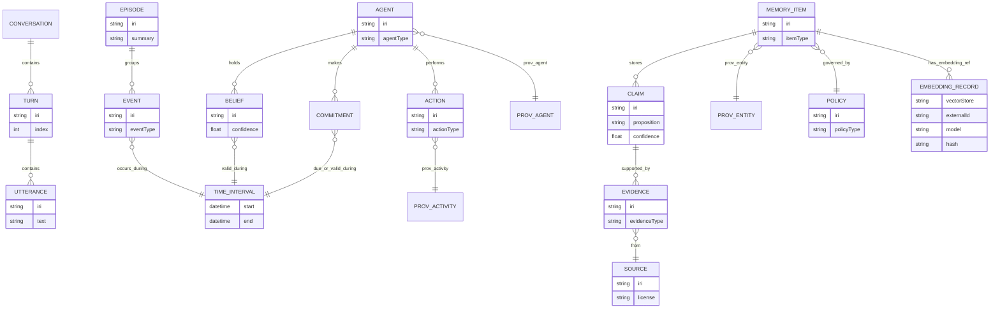
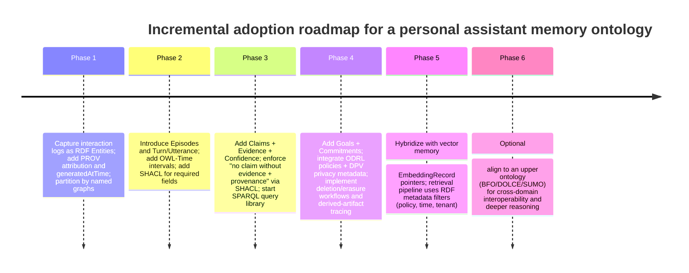

# Ontology Design for Personal Assistant Agents, Actions, Events, and Memory Events

## Executive summary

A durable ontology for personal assistant bots should be engineered as a **modular, event-centric semantic layer** over agent interaction logs and memory stores, with first-class support for **provenance, time, governance, and revision**. The most robust baseline is to model the *records* the assistant stores (episodes, claims, evidence objects, embeddings) as **information artifacts** (RDF/OWL individuals), and then attach provenance and temporal semantics using established standards: **RDF/RDFS + OWL 2** for the core data model and semantics, **PROV-O/PROV-DM** for provenance and revision chains, **OWL-Time** for instants/intervals and temporal relations, and **SHACL** for validation gates on writes/updates. citeturn6view0turn9view0turn6view1turn17search1turn0search3turn6view2turn14view0

For “statements about statements” (confidence, evidence, privacy level, validity interval), the ontology should avoid over-reliance on RDF’s classic **reification vocabulary** (rdf:Statement) unless interoperability requires it. In practice, modeling a **Claim** as an explicit node (an n‑ary relation pattern) and linking it to subject/predicate/object (or a structured proposition), plus Evidence and provenance, tends to be clearer, more queryable, and easier to validate with SHACL. This is consistent with W3C guidance on representing n‑ary relations when you need to attach metadata (certainty, severity, roles, etc.) to a relation instance. citeturn1search3turn9view0

At scale, you should assume heterogeneous storage: an RDF triple store (or quad store) for **governed, structured memory**, plus a vector index for **semantic retrieval**. The ontology should therefore include **stable identifiers and metadata** that reference vector-store entries (embedding IDs, index namespaces, chunk hashes) without trying to “store vectors in RDF” as first-class numeric arrays. RDF datasets and named graphs—serializable via TriG—provide a standardized mechanism to segment memory by **context**, **access policy**, **tenancy**, or **revision state**. citeturn6view0turn6view3turn5search3

Finally, governance must be explicit: personal assistant memory is a data retention system, so model **consent, sensitivity, usage control (ODRL), and erasure workflows (GDPR Art. 17)** as metadata that can drive enforcement and auditing. DPV can supply privacy concepts, ODRL can express usage policies, and PROV can preserve the “why/how” of each stored item (including revisions) for accountability. citeturn3search4turn12view1turn3search22turn3search3turn6view1

## Goals and scope

This report designs an ontology (a shared conceptual vocabulary) for **personal assistant bots** that need to represent:

- **Agents** (humans, bots, organizations), their roles, and multi-agent collaboration.
- **Interaction structure** (turns, utterances, tool calls, observations).
- **Events and episodes** (time-bounded clusters of interaction and world events).
- **Memory items** (persisted artifacts: transcripts, summaries, extracted claims, embeddings pointers).
- **Epistemic content** (claims and beliefs with confidence, evidence, and validity intervals).
- **Governance** (provenance, versioning, editability, privacy, and deletion).

The domain is **unspecified** and scale is **unspecified**, so the recommended design separates a compact, domain-neutral core from domain extensions and from storage/serving concerns. This matches mainstream ontology engineering guidance: define purpose and competency questions, reuse existing vocabularies where possible, and keep domain assumptions explicit to support change. citeturn4search3turn10search0

Non-goals: this report does not attempt to fully encode every possible “world domain” (calendar, travel, health, finance, etc.). Instead it specifies an extensible scaffolding that can align to such domain ontologies later (e.g., schema.org or an ISO top-level ontology mapping choice). citeturn2search0turn4search0

## Ontology requirements and constraints

A personal-assistant memory ontology must satisfy requirements that are simultaneously semantic (meaning), operational (write/read/validate), and governance-oriented (policy and compliance). The requirements below are phrased as **design obligations** that should be testable with SHACL, queryable with SPARQL, and auditable with provenance.

Interoperability requires the ontology to be representable as RDF graphs, with schema constraints in RDFS/OWL 2, and queryable via SPARQL. RDF defines graphs as sets of triples, supports RDF datasets (collections of named graphs), and is designed for integrating information across sources. SPARQL defines query semantics for RDF data and supports querying across diverse data sources. citeturn6view0turn1search0turn1search2turn14view0

Provenance requirements are best met by PROV: each stored memory item should be attributable to an agent, have a generating activity (e.g., “summarization”), record inputs used, and support revision chains. PROV-O provides classes and properties for interoperable provenance representation; PROV-DM describes the conceptual model and extensibility points. citeturn6view1turn17search1turn17search2turn19view0

Temporal reasoning must represent (a) when events occurred, (b) when a memory record was created, and (c) validity intervals for beliefs/commitments. OWL-Time provides a vocabulary for instants/intervals and topological relations among them (before/after, etc.), and RDF itself is “atemporal” (graphs are snapshots) so time must be modeled explicitly in the data. citeturn0search3turn7view1

Privacy, consent, and usage control require metadata that can be enforced: ODRL provides a policy information model and an RDF vocabulary for permissions/prohibitions/obligations; DPV provides privacy vocabulary concepts intended for GDPR-aligned metadata; GDPR Art. 17 motivates explicit erasure capability. citeturn3search4turn12view1turn3search22turn3search3

Versioning and editability require (1) ontology artifact versioning and (2) data revision semantics. OWL 2 defines conventions for ontology IRIs and version IRIs, and includes annotation properties (e.g., owl:priorVersion) useful for ontology lifecycle; PROV includes prov:wasRevisionOf and qualified relations that can capture roles and plans. SPARQL Update defines operations to update graph stores. citeturn16view1turn16view2turn6view1turn1search21

Confidence and evidence require representational patterns for “statements about statements.” RDF Schema defines reification vocabulary (rdf:Statement, rdf:subject/predicate/object), but W3C also recommends n‑ary relation patterns when you need to attach metadata such as certainty, severity, and roles to relation instances. In addition, the W3C has chartered work to integrate RDF-star/quoted triples into newer RDF and SPARQL revisions; however these remain specifications-in-progress and should be treated as evolving rather than stable baseline dependencies. citeturn9view0turn1search3turn11view1turn11view0

## Core model: classes, properties, and modular structure

A practical ontology should be split into modules with a clear **core namespace** (e.g., `pa:`) and imports for standard vocabularies. OWL 2 provides imports and structural conventions for ontologies; W3C best-practice guidance emphasizes publishability and stable namespace management for reuse. citeturn14view0turn10search5

### Recommended module boundaries

**Identity & actors module**
- `pa:Agent` (superclass)
- `pa:Person` (human)
- `pa:Bot` (assistant or other software agent)
- `pa:Organization` (optional)
- `pa:AgentRole` (role vocabulary; often implemented by reusing PROV roles)

PROV already supplies `prov:Agent` and subclasses `prov:Person`, `prov:Organization`, `prov:SoftwareAgent`, plus `prov:Role` and role-qualified relations (`prov:hadRole`). FOAF supplies widely used person/agent vocabulary foundations. citeturn6view1turn19view0turn12view2

**Interaction module**
- `pa:Conversation`
- `pa:Turn`
- `pa:Utterance`
- `pa:Observation` (perception or ingestion event)
- `pa:Tool` / `pa:ToolInvocation`
- `pa:Context` (dialog/task context; also maps to named graphs)

SIOC provides concepts for online community content (posts, etc.) that can be selectively reused for interchange; ActivityStreams provides a standardized activity model (Actor/Object/Activity) that aligns well with logging actions and events. citeturn12view3turn13view0

**Events & episodes module**
- `pa:Event` (occurrence in time)
- `pa:Action` (intentional event, usually agent-caused)
- `pa:Episode` (time-bounded bundle/cluster of events; often the unit of episodic memory)
- `pa:TimeInterval` (use OWL-Time `time:Interval` / `time:Instant`)

OWL-Time is the preferred baseline for temporal entities and relations. citeturn0search3turn7view1

**Memory & epistemics module**
- `pa:MemoryItem` (persisted information artifact)
- `pa:Claim` (statement-like object with propositional content)
- `pa:Belief` (agent-indexed stance toward a claim; time-indexed; includes confidence)
- `pa:Evidence` (supporting artifact, excerpt, or reference)
- `pa:Source` (document, system, sensor, web page)
- `pa:Provenance` (usually represented directly using PROV-O structures)

PROV describes core provenance concepts (Entity/Activity/Agent) and includes revision and quotation relations (prov:wasRevisionOf, prov:wasQuotedFrom, etc.) useful for memory pipelines. citeturn6view1turn19view0

**Goals, commitments, and policy module**
- `pa:Goal` (objective)
- `pa:Commitment` (social commitment / promise / obligation)
- `pa:Policy` (access/usage policy)
- `pa:PolicyDecision` (optional: enforcement decision record)

PROV’s `prov:Plan` can represent a set of intended steps to achieve goals; ODRL can encode permissions/obligations/prohibitions about data use; DPV can annotate personal data processing/consent semantics. citeturn19view3turn3search4turn12view1turn3search22

### Core object properties (illustrative, not exhaustive)

The following “spine” properties are usually sufficient to support most assistant tasks:

- `pa:hasParticipant (Episode/Event/Conversation → Agent)`
- `pa:hasTurn (Conversation → Turn)`; `pa:hasUtterance (Turn → Utterance)`
- `pa:mentionsEntity (Utterance/Episode/Claim → IRI)` (entity linking hook)
- `pa:recordsEvent (MemoryItem → Event)` (memory record about an event)
- `pa:assertsClaim (Utterance/MemoryItem → Claim)`
- `pa:hasBelief (Agent → Belief)`; `pa:aboutClaim (Belief → Claim)`
- `pa:supportedBy (Claim/Belief → Evidence)`; `pa:hasSource (Evidence → Source)`
- `pa:validDuring (Belief/Commitment → time:Interval)`
- `pa:governedByPolicy (MemoryItem → odrl:Policy)` (or a `pa:Policy` wrapper)
- `pa:embeddingRef (MemoryItem → pa:EmbeddingRecord)` (vector-store hook)

These should typically be backed by PROV relations for provenance (e.g., `prov:wasGeneratedBy`, `prov:wasDerivedFrom`, `prov:wasAttributedTo`) and OWL-Time relations/structures for time. citeturn6view1turn0search3turn19view0

### Mermaid ER diagram for the proposed core



## Modeling patterns and standards alignment

This section focuses on the “hard parts” of assistant memory ontologies: contextualization, statement metadata, temporal change, and multi-store interoperability.

### Patterns for statement metadata: reification vs named graphs vs n‑ary vs RDF-star (draft)

Table 1 compares the dominant patterns for attaching confidence, evidence, and provenance to statements, drawing from RDF Schema’s reification vocabulary, RDF datasets/named graphs (TriG), and W3C guidance on n‑ary relations. citeturn9view0turn6view0turn6view3turn1search3

| Pattern | Basic idea | Strengths | Weaknesses | Best used for |
|---|---|---|---|---|
| RDF reification (`rdf:Statement`, `rdf:subject/predicate/object`) | Represent a triple as a resource, then attach metadata | Standardized vocabulary in RDF Schema | Verbose; semantics often misunderstood; tooling varies | Legacy interop; minimal metadata on triples |
| Named graphs / RDF datasets | Put assertions into a named graph; attach metadata to the graph (or manage access by graph) | Natural for “context = graph”; works well with provenance bundles and access control; TriG serializes datasets | Graph-level metadata may be too coarse when each claim needs different evidence/confidence | Context partitioning; policy scoping; tenant separation; revision snapshots |
| N‑ary relation (Claim node) | Create an explicit `pa:Claim` instance and link to its arguments + metadata | Most flexible; SHACL validation is straightforward; easy to attach evidence/confidence/time | Requires modeling discipline; subject/predicate/object may not be a simple triple | Claims, beliefs, commitments, tool invocations with rich annotations |
| RDF-star / quoted triples (emerging) | Use “quoted triple” terms as objects/subjects to make statements about statements | More concise than reification; targets statement annotations directly | Still evolving in W3C process; production interoperability risk until stable | Consider behind a compatibility layer, not as sole foundation |

The W3C explicitly notes that when a relation needs properties like certainty/strength or involves more than two arguments, an n‑ary pattern that introduces a relation-instance resource is often appropriate. citeturn1search3turn7view1 The W3C has also chartered work to extend RDF/SPARQL with quoted triples (RDF-star) to improve statement-level metadata expressiveness, but current publications in this area should be treated as drafts-in-progress rather than settled recommendations. citeturn11view1turn11view0turn11view3

### Event-centric vs entity-centric modeling

A personal assistant’s memory is naturally **event-centric**: most recall questions are about what happened, who said what, what was promised, what tool ran, and what changed. RDF itself is a snapshot model (“atemporal”), so event-centric modeling paired with OWL-Time provides a clean basis for temporal reasoning. citeturn7view1turn0search3

Two common viewpoints are:

- **Event-centric**: model `pa:Event`/`pa:Action`/`pa:Turn` richly; link entities via roles (actor, patient, instrument/tool). This aligns well with PROV’s Activity/Agent/Entity triad and qualified relations with roles and plans. citeturn6view1turn19view0turn19view3
- **Entity-centric**: model entities (tasks, contacts, projects) as primary, and model events as changes to entity state. This can be simpler for CRUD-style applications, but requires careful patterns for time-varying properties.

If your assistant must represent **time-varying states** (“the user’s address changed”), there are established modeling patterns beyond attaching timestamps naively. W3C notes n‑ary approaches; ontology engineering literature also uses perdurantist/4D-fluent patterns that model temporal parts and fluents explicitly (useful, but heavier). citeturn1search3turn17search26

### Alignment map: how core classes reuse standards

A pragmatic alignment strategy is “reuse first, extend second.” The standards below are stable anchors:

- **RDF/RDFS**: base graph model; basic schema constructs; reification vocabulary. citeturn6view0turn9view0turn1search2
- **OWL 2**: richer class/property axioms; imports; ontology versioning conventions; annotations like owl:priorVersion. citeturn16view1turn16view2
- **PROV-O / PROV-DM**: provenance, revision chains, qualified roles (`prov:hadRole`), plans (`prov:Plan`), and bundling. citeturn6view1turn17search1turn19view0turn19view3
- **OWL-Time**: instants/intervals; ordering relations, duration, temporal positions. citeturn0search3turn0search11
- **schema.org**: lightweight types for persons/events/actions; schema.org’s data model is derived from RDF Schema and is widely adopted on the web. citeturn2search0turn2search24
- **FOAF**: people/agents; pragmatic web vocabulary built on RDF. citeturn12view2
- **SIOC**: online community content (posts, creators) for conversation artifacts when interop with social/community tooling is needed. citeturn12view3
- **ActivityStreams 2.0**: activity logs and actors/objects; includes privacy/security considerations and JSON-LD context usage. citeturn13view0
- **ODRL 2.2**: policy model/vocabulary for permissions, prohibitions, and obligations; includes RDF/JSON-LD support. citeturn3search4turn12view1
- **DPV**: privacy vocabulary for processing metadata, consent, rights; explicitly positioned to support GDPR-related metadata. citeturn3search22turn3search16

For upper-level alignment (optional), the choice mainly affects how you classify “events vs continuants” and how you treat information artifacts. **BFO** is standardized under ISO/IEC 21838-2 and is designed to support interoperable exchange across heterogeneous systems; **DOLCE** is a foundational ontology maintained by the LOA/CNR group and has also been incorporated into ISO top-level ontology standardization; **SUMO** is an upper ontology ecosystem with broad mappings (e.g., WordNet) and is described as owned by IEEE on the project portal. citeturn4search0turn4search1turn4search2

image_group{"layout":"carousel","aspect_ratio":"16:9","query":["PROV-O entity activity agent diagram","OWL-Time interval instant diagram","SHACL shapes constraint language diagram","RDF named graphs TriG diagram"],"num_per_query":1}

### RDF/OWL vs property graphs in assistant memory systems

Property graphs can be attractive for some workloads (high-throughput traversals, graph analytics, or teams already invested in property-graph infrastructure). ISO has standardized GQL (ISO/IEC 39075:2024) as a database language for property graphs, defining data structures and operations. citeturn5search2

However, ontologies and semantic interoperability are natively supported in the RDF/OWL stack via standardized semantics, entailment regimes, and W3C governance tooling, which is usually the primary motivation for “assistant memory” ontologies.

Table 2 compares the stacks using primary references for RDF/SPARQL and for property-graph standards (ISO GQL / openCypher / TinkerPop docs). citeturn6view0turn1search0turn5search2turn5search0turn5search1

| Dimension | RDF/OWL + SPARQL | Property graph + GQL/Cypher/Gremlin |
|---|---|---|
| Standard semantic model | Strong W3C standardization (RDF/RDFS/OWL/SPARQL) | ISO standardization exists for GQL; other dialects vendor/community driven |
| Ontology semantics & reasoning | OWL 2 provides formal semantics and tooling ecosystem | Typically application-level schema; reasoning not standardized |
| Provenance & linked data interop | PROV/IRI-based linking is mainstream | Possible, but interop varies by platform |
| Validation | SHACL is a W3C standard for constraint validation | Often custom constraints or vendor tooling |
| Typical sweet spot | Interop, governance, formal semantics, auditability | High-throughput traversal, graph analytics, operational familiarity |

## Validation and query patterns: SHACL shapes, Turtle snippets, and SPARQL recipes

A personal assistant ontology only becomes operationally safe when it is paired with two capabilities: **(1) validation gates for writes** and **(2) canonical query recipes** for common tasks. SHACL defines validation of RDF graphs via shapes graphs and data graphs; SPARQL defines query semantics and is designed for querying RDF across diverse sources. citeturn6view2turn1search0

### Turtle snippets for key constructs (illustrative)

Below is an intentionally compact example showing: Agents (person + bot), a conversation with turns/utterances, an episode, and an extracted claim that is supported by evidence and PROV provenance.

```turtle
@prefix pa:   <https://example.org/pa#> .
@prefix prov: <http://www.w3.org/ns/prov#> .
@prefix time: <http://www.w3.org/2006/time#> .
@prefix xsd:  <http://www.w3.org/2001/XMLSchema#> .
@prefix foaf: <http://xmlns.com/foaf/0.1/> .
@prefix odrl: <http://www.w3.org/ns/odrl/2/> .

# Agents
pa:User_123 a pa:Person, prov:Person, prov:Agent, foaf:Person ;
  foaf:name "User 123"@en .

pa:AssistantBot a pa:Bot, prov:SoftwareAgent, prov:Agent ;
  foaf:name "Personal Assistant Bot"@en .

# Conversation and turns
pa:Conv_2026_02_18 a pa:Conversation ;
  pa:hasParticipant pa:User_123, pa:AssistantBot ;
  pa:hasTurn pa:Turn_1, pa:Turn_2 .

pa:Turn_1 a pa:Turn ;
  pa:turnIndex 1 ;
  pa:speaker pa:User_123 ;
  pa:hasUtterance pa:Utt_1 .

pa:Utt_1 a pa:Utterance ;
  pa:text "Remind me tomorrow to call Alex."@en ;
  pa:mentionsEntity pa:Alex .

# Episode (episodic memory item)
pa:Episode_789 a pa:Episode, pa:MemoryItem, prov:Entity ;
  pa:summary "Scheduling request to call Alex."@en ;
  pa:recordsEvent pa:Turn_1 ;
  prov:wasAttributedTo pa:AssistantBot ;
  prov:generatedAtTime "2026-02-18T16:10:00-06:00"^^xsd:dateTime ;
  pa:governedByPolicy pa:Policy_PrivateByDefault .

# Claim extracted from episode (statement-level metadata)
pa:Claim_001 a pa:Claim, prov:Entity ;
  pa:proposition "User requests a reminder to call Alex on 2026-02-19."@en ;
  pa:confidenceScore "0.82"^^xsd:decimal ;
  pa:supportedBy pa:Evidence_001 ;
  prov:wasDerivedFrom pa:Episode_789 .

pa:Evidence_001 a pa:Evidence, prov:Entity ;
  pa:evidenceText "Remind me tomorrow to call Alex."@en ;
  prov:wasDerivedFrom pa:Utt_1 .

# Policy (ODRL-aligned hook)
pa:Policy_PrivateByDefault a odrl:Policy ;
  odrl:profile <https://example.org/pa/policy-profile/v1> .
```

This pattern leverages PROV’s ability to represent entities/activities/agents and derivation chains (prov:wasDerivedFrom, prov:wasAttributedTo, prov:generatedAtTime), while keeping assistant-specific semantics in a dedicated namespace. citeturn6view1turn17search2turn19view0

### SHACL shapes: validation gates for “safe memory writes”

The shapes below illustrate how to enforce “no ungrounded claims,” “confidence in range,” and “every memory item has provenance + governance metadata.” SHACL defines shapes graphs and validation conditions over RDF data graphs. citeturn6view2turn1search1

```turtle
@prefix sh:   <http://www.w3.org/ns/shacl#> .
@prefix pa:   <https://example.org/pa#> .
@prefix prov: <http://www.w3.org/ns/prov#> .
@prefix odrl: <http://www.w3.org/ns/odrl/2/> .
@prefix time: <http://www.w3.org/2006/time#> .
@prefix xsd:  <http://www.w3.org/2001/XMLSchema#> .

# MemoryItem must be attributable, time-stamped, and policy-governed
pa:MemoryItemShape a sh:NodeShape ;
  sh:targetClass pa:MemoryItem ;
  sh:property [
    sh:path prov:wasAttributedTo ;
    sh:minCount 1 ;
    sh:nodeKind sh:IRI ;
  ] ;
  sh:property [
    sh:path prov:generatedAtTime ;
    sh:minCount 1 ;
    sh:datatype xsd:dateTime ;
  ] ;
  sh:property [
    sh:path pa:governedByPolicy ;
    sh:minCount 1 ;
    sh:class odrl:Policy ;
  ] .

# Claim must have proposition, confidence in [0,1], and at least one Evidence
pa:ClaimShape a sh:NodeShape ;
  sh:targetClass pa:Claim ;
  sh:property [
    sh:path pa:proposition ;
    sh:minCount 1 ;
    sh:datatype xsd:string ;
  ] ;
  sh:property [
    sh:path pa:confidenceScore ;
    sh:minCount 1 ;
    sh:datatype xsd:decimal ;
    sh:minInclusive 0.0 ;
    sh:maxInclusive 1.0 ;
  ] ;
  sh:property [
    sh:path pa:supportedBy ;
    sh:minCount 1 ;
    sh:class pa:Evidence ;
  ] ;
  sh:property [
    sh:path prov:wasDerivedFrom ;
    sh:minCount 1 ;
    sh:nodeKind sh:IRI ;
  ] .

# Commitment must specify promisor, promisee, content, and a validity/due interval
pa:CommitmentShape a sh:NodeShape ;
  sh:targetClass pa:Commitment ;
  sh:property [
    sh:path pa:promisor ;
    sh:minCount 1 ; sh:nodeKind sh:IRI ;
  ] ;
  sh:property [
    sh:path pa:promisee ;
    sh:minCount 1 ; sh:nodeKind sh:IRI ;
  ] ;
  sh:property [
    sh:path pa:commitmentContent ;
    sh:minCount 1 ; sh:datatype xsd:string ;
  ] ;
  sh:property [
    sh:path pa:validDuring ;
    sh:minCount 1 ; sh:class time:Interval ;
  ] .
```

The justification for these gates is architectural: RDF can represent any triples, so quality and governance constraints must be layered using validation and policy tooling; SHACL was explicitly standardized to validate RDF graphs against a set of conditions. citeturn6view2turn6view0

### SPARQL query recipes for common assistant tasks

SPARQL defines syntax/semantics for querying RDF and is suitable for querying across sources, with capabilities like graph pattern matching, optional patterns, and (in SPARQL 1.1) property paths and aggregates. citeturn1search0turn1search4

**Retrieve active commitments made by the assistant to a given user (time-bounded)**

```sparql
PREFIX pa:   <https://example.org/pa#>
PREFIX time: <http://www.w3.org/2006/time#>
PREFIX xsd:  <http://www.w3.org/2001/XMLSchema#>

SELECT ?commitment ?content ?start ?end
WHERE {
  ?commitment a pa:Commitment ;
              pa:promisor pa:AssistantBot ;
              pa:promisee pa:User_123 ;
              pa:commitmentContent ?content ;
              pa:validDuring ?interval .
  ?interval time:hasBeginning/time:inXSDDateTime ?start ;
            time:hasEnd/time:inXSDDateTime ?end .
  FILTER (NOW() >= ?start && NOW() <= ?end)
}
ORDER BY ?end
```

**Find episodes that mention a specific entity X (by IRI) and return summaries + provenance**

```sparql
PREFIX pa:   <https://example.org/pa#>
PREFIX prov: <http://www.w3.org/ns/prov#>

SELECT ?episode ?summary ?when ?who
WHERE {
  ?episode a pa:Episode ;
           pa:summary ?summary ;
           pa:mentionsEntity pa:Alex ;
           prov:generatedAtTime ?when ;
           prov:wasAttributedTo ?who .
}
ORDER BY DESC(?when)
LIMIT 50
```

**Get a provenance chain for a memory item (derive lineage transitively)**

```sparql
PREFIX prov: <http://www.w3.org/ns/prov#>

SELECT ?ancestor
WHERE {
  pa:Claim_001 (prov:wasDerivedFrom|prov:wasRevisionOf)+ ?ancestor .
}
```

These queries rely on PROV relations for derivation/revision and on SPARQL’s graph pattern and property path features. citeturn6view1turn1search0turn19view0

## Implementation guidance, privacy/security, evaluation criteria, and an adoption roadmap

### Storage architecture choices and hybrid vector memory mapping

RDF datasets and named graphs provide a standardized way to partition data into a default graph plus named graphs, which is directly useful for multi-tenant assistants and for separating “private memory,” “shared team memory,” and “public knowledge.” TriG is a W3C Recommendation for serializing RDF datasets. citeturn6view0turn6view3

A realistic system often uses **hybrid storage**:
- **Quad store / triple store** for governed, queryable facts, commitments, provenance, and policies (the “source of truth” for structured memory).
- **Vector store** for approximate semantic retrieval over unstructured text (episode text, summaries, document chunks).
- Optional **property graph** if teams require high-throughput traversals or already standardized on property-graph operations; ISO/IEC 39075 (GQL) standardizes a property-graph database language, and openCypher explicitly positions itself as evolving toward that ISO standard. citeturn5search2turn5search0turn5search3

Table 3 compares the most common hybrid patterns.

| Pattern | What lives in RDF | What lives in vector DB | Typical benefits | Typical pitfalls |
|---|---|---|---|---|
| “Vector-first, RDF as metadata” | Episode metadata, policies, provenance pointers | Most text chunks + embeddings | Fast semantic recall; minimal modeling upfront | Weak governance if claims aren’t normalized; hard to answer structured queries |
| “RDF-first, vector for recall” | Claims/commitments/goals + provenance + canonical entities | Episode text/summaries for fuzzy recall | Strong auditability; exact queries + fuzzy assist | Requires stronger write pipeline; ontology discipline |
| “Dual-write, dual-read (router)” | Structured memory + policies | Retrieval corpus | Best performance/flexibility | Consistency drift; more complex evaluation |

A minimal mapping pattern is to model embedding references as stable IRIs:

- `pa:EmbeddingRecord` as a PROV Entity (an information artifact about an embedding).
- Properties: `pa:externalVectorStore`, `pa:externalId`, `pa:embeddingModel`, `pa:chunkHash`.
- Link: `pa:embeddingRef` from `pa:MemoryItem` to `pa:EmbeddingRecord`.

This keeps RDF focused on identity, provenance, and governance, while vectors remain in purpose-built infrastructure.

### Privacy/security modeling: access control, redaction, erasure, and consent

Personal assistant memory requires explicit governance hooks:

- **Erasure**: GDPR Art. 17 motivates the requirement that personal data can be deleted “without undue delay” under qualifying conditions; operationally, this implies that memory items must be discoverable and deletable, including downstream derived artifacts (summaries, embeddings) and provenance records (which may need redaction strategies). citeturn3search3turn3search13
- **Usage control**: ODRL’s model and vocabulary provide standardized constructs for permissions, prohibitions, and obligations, and are explicitly designed for machine-readable policy statements over content/services usage. citeturn3search4turn12view1
- **Privacy metadata**: DPV provides privacy vocabulary concepts intended for expressing metadata about data processing, consent, rights, and related concepts grounded in legislative requirements such as GDPR. citeturn3search22turn3search16
- **Provenance for accountability**: PROV enables representing entities, activities, and agents involved in producing a memory item, which supports auditing “why does the assistant believe this?” and enables controlled revision with prov:wasRevisionOf. citeturn6view1turn19view0

A practical enforcement pattern is “policy by named graph”:
- Store sensitive items in a named graph whose IRI encodes scope (e.g., `graph:private/user123`).
- Attach an ODRL policy to that graph (or to a `pa:Context` resource representing the graph).
- Validate that any derived claims inherit or tighten policy constraints (SHACL can enforce inheritance rules with shapes or SHACL rules extensions as they mature). citeturn6view0turn12view1turn6view2

### Evaluation criteria for ontology quality and operational fitness

Ontology design quality should be assessed along three axes, borrowed from established ontology engineering practice and adapted to assistant memory operations:

- **Competency-question coverage**: Can the ontology answer the defined questions (commitments, episodes about X, provenance chain)? Ontology engineering guidance emphasizes competency questions as a driver of scope and evaluation. citeturn4search3turn10search0
- **Consistency and constraint conformance**: Do data graphs validate against SHACL shapes; do OWL constraints (where used) avoid contradictions? SHACL provides formal validation conditions, and OWL provides a formal semantics for ontology axioms. citeturn6view2turn14view0
- **Query performance and governance**: Are the common SPARQL queries performant; are policy checks and deletions auditable; can revisions be traced? SPARQL provides the query language foundation; PROV provides provenance traceability. citeturn1search0turn6view1

### Incremental adoption roadmap

An incremental roadmap reduces risk by separating “log first” from “semantic memory later,” while ensuring governance is present from day one.



This sequencing reflects both ontology development best practices (start with purpose, reuse, iterate) and the reality that RDF graphs are snapshots requiring explicit time/provenance modeling for trustworthy assistant memory. citeturn4search3turn7view1turn6view1turn6view2

### Primary specification links (URL list)

```text
W3C RDF 1.1 Concepts: https://www.w3.org/TR/rdf11-concepts/
W3C RDF Schema 1.1 (incl. reification vocabulary): https://www.w3.org/TR/rdf-schema/
W3C OWL 2 Structural Spec: https://www.w3.org/TR/owl2-syntax/
W3C SPARQL 1.1 Query: https://www.w3.org/TR/sparql11-query/
W3C SPARQL 1.1 Update: https://www.w3.org/TR/sparql11-update/
W3C SHACL: https://www.w3.org/TR/shacl/
W3C PROV-O: https://www.w3.org/TR/prov-o/
W3C PROV-DM: https://www.w3.org/TR/prov-dm/
W3C OWL-Time: https://www.w3.org/TR/owl-time/
W3C ActivityStreams 2.0: https://www.w3.org/TR/activitystreams-core/
W3C ODRL Model: https://www.w3.org/TR/odrl-model/
W3C ODRL Vocab: https://www.w3.org/TR/odrl-vocab/
schema.org data model: https://schema.org/docs/datamodel.html
FOAF specification: https://xmlns.com/foaf/spec/
SIOC specification: https://www.w3.org/submissions/sioc-spec/
DPV (W3C CG Final report): https://w3c.github.io/cg-reports/dpvcg/CG-FINAL-dpv-20221205/
GDPR Article 17 text: https://gdpr-info.eu/art-17-gdpr/
```

For organizational anchors referenced above: the entity["organization","World Wide Web Consortium","web standards body"] publishes the W3C Recommendations on RDF/OWL/SPARQL/SHACL/PROV/OWL-Time/ODRL/ActivityStreams; the entity["organization","International Organization for Standardization","international standards body"] publishes ISO/IEC standards such as ISO/IEC 21838‑2 (BFO) and ISO/IEC 39075 (GQL). citeturn6view0turn6view1turn6view2turn13view0turn12view1turn5search2turn4search0
